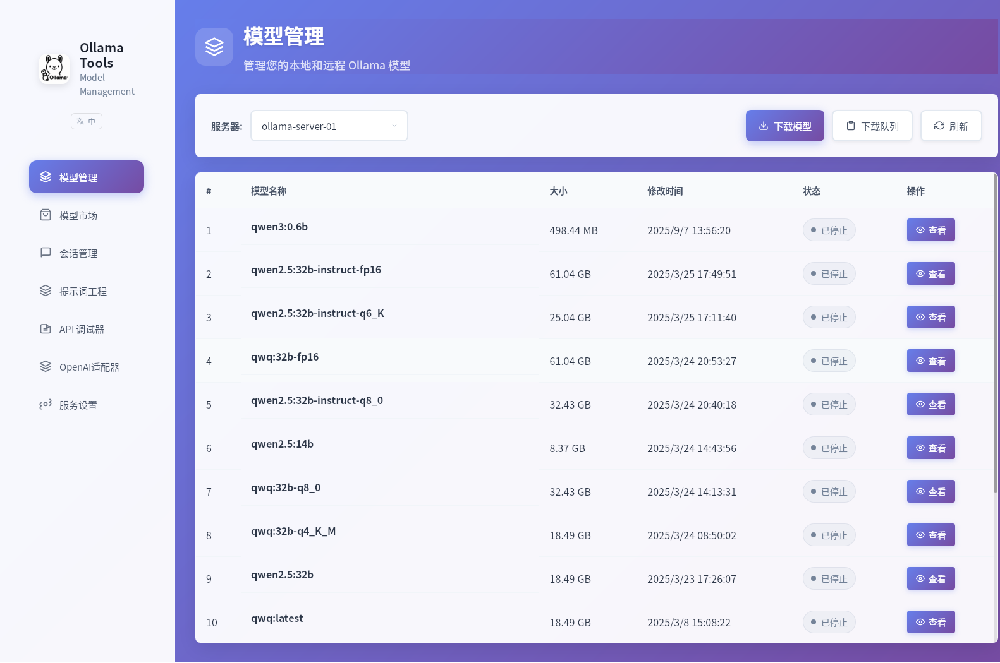
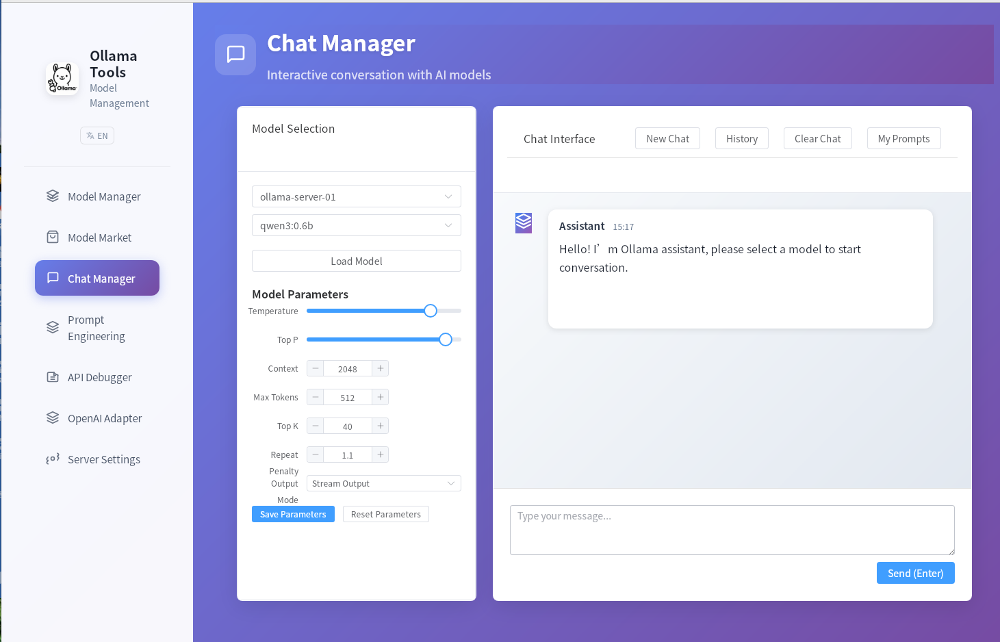

<div align="center">
  
  
  # 🦙 Ollama Tools
  
  **Professional Ollama Model Management Desktop Application**
  
  [](https://opensource.org/licenses/MIT)
  [](https://golang.org/)
  [](https://wails.io/)
  [](https://vuejs.org/)
  [](https://github.com/wailsapp/wails)
  
  [English](README.md) | [中文](README_zh.md)
  
</div>

## ✨ Features

- 🌐 **Multi-Server Support** - Manage local and multiple remote Ollama servers
- 🤖 **Model Management** - View, run, stop, and delete large language models
- ⚙️ **Parameter Configuration** - Configure model parameters (temperature, topP, context size, etc.)
- 🔍 **Smart Search** - Search models by name, family, tags, and more
- 💬 **Chat Interface** - Built-in chat interface for model testing
- 🎯 **Prompt Management** - Organize and manage your prompts
- 🔌 **OpenAI API Adapter** - Compatible with OpenAI API ecosystem
- 🎨 **Modern UI** - Beautiful interface built with Vue.js and modern design principles
- 🚀 **High Performance** - Native desktop performance with Wails framework

## 📸 Screenshots

<div align="center">
  
  <p><em>Main Interface - Model Management</em></p>
</div>

<div align="center">
  
  <p><em>Chat Interface - Interactive Testing</em></p>
</div>

## 🚀 Quick Start

### Prerequisites

- **Go** 1.24+ ([Download](https://golang.org/dl/))
- **Node.js** 18+ ([Download](https://nodejs.org/))
- **Wails CLI** ([Installation Guide](https://wails.io/docs/gettingstarted/installation))
- **Ollama** ([Installation Guide](https://ollama.ai/))

### Installation

#### Option 1: Download Pre-built Binaries

1. Go to [Releases](https://github.com/your-username/tools-ollama/releases)
2. Download the appropriate version for your platform
3. Extract and run the executable

#### Option 2: Build from Source

```bash
# Clone the repository
git clone https://github.com/your-username/tools-ollama.git
cd tools-ollama

# Install frontend dependencies
cd frontend
npm install
cd ..

# Build the application
wails build

# The built application will be in the build/bin directory
```

### Development

```bash
# Clone the repository
git clone https://github.com/your-username/tools-ollama.git
cd tools-ollama

# Install dependencies
cd frontend
npm install
cd ..

# Run in development mode
wails dev
```

## 🛠️ Configuration

### Ollama Server Setup

1. **Local Ollama**: Install Ollama on your machine
2. **Remote Ollama**: Configure remote server endpoints in settings
3. **API Access**: Ensure Ollama API is accessible (default: `http://localhost:11434`)

### First Run

1. Launch the application
2. Go to **Settings** → **Ollama Settings**
3. Add your Ollama server(s)
4. Start exploring and managing your models!

## 📚 Documentation

- [User Guide](docs/user-guide.md) - Complete user manual
- [API Documentation](docs/api.md) - API reference
- [Development Guide](docs/development.md) - For contributors
- [Troubleshooting](docs/troubleshooting.md) - Common issues and solutions

## 🏗️ Architecture

```
tools-ollama/
├── 📁 frontend/          # Vue.js frontend application
│   ├── src/
│   │   ├── views/        # Page components
│   │   ├── components/   # Reusable components
│   │   ├── stores/       # Pinia state management
│   │   └── assets/       # Static assets
│   └── package.json
├── 📁 docs/              # Documentation
├── 📄 main.go            # Application entry point
├── 📄 app.go             # Main application logic
├── 📄 model_manager.go   # Model management
├── 📄 chat_manager.go    # Chat functionality
├── 📄 ollama_config.go   # Configuration management
├── 📄 wails.json         # Wails configuration
└── 📄 go.mod             # Go dependencies
```

## 🤝 Contributing

We welcome contributions! Please see our [Contributing Guide](CONTRIBUTING.md) for details.

### Development Setup

1. Fork the repository
2. Create your feature branch (`git checkout -b feature/amazing-feature`)
3. Commit your changes (`git commit -m 'Add some amazing feature'`)
4. Push to the branch (`git push origin feature/amazing-feature`)
5. Open a Pull Request

### Code Style

- **Go**: Follow standard Go conventions and use `gofmt`
- **Vue.js**: Use TypeScript and follow Vue 3 Composition API patterns
- **Commits**: Use [Conventional Commits](https://conventionalcommits.org/)

## 🐛 Bug Reports & Feature Requests

- **Bug Reports**: [Create an Issue](https://github.com/your-username/tools-ollama/issues/new?template=bug_report.md)
- **Feature Requests**: [Create an Issue](https://github.com/your-username/tools-ollama/issues/new?template=feature_request.md)
- **Questions**: [Start a Discussion](https://github.com/your-username/tools-ollama/discussions)

## 📋 Roadmap

- [ ] **Model Marketplace** - Browse and install models from community
- [ ] **Plugin System** - Extend functionality with plugins
- [ ] **Cloud Sync** - Sync configurations across devices
- [ ] **Advanced Analytics** - Model usage statistics and insights
- [ ] **Team Collaboration** - Share models and configurations
- [ ] **Mobile App** - Companion mobile application

## 🙏 Acknowledgments

- [Ollama](https://ollama.ai/) - For the amazing local LLM runtime
- [Wails](https://wails.io/) - For the excellent Go + Web desktop framework
- [Vue.js](https://vuejs.org/) - For the reactive frontend framework
- [Element Plus](https://element-plus.org/) - For the beautiful UI components

## 📄 License

This project is licensed under the MIT License - see the [LICENSE](LICENSE) file for details.

## 🌟 Star History

[](https://star-history.com/#your-username/tools-ollama&Date)

---

<div align="center">
  <p>Made with ❤️ by the Ollama Tools Team</p>
  <p>
    <a href="https://github.com/your-username/tools-ollama">GitHub</a> •
    <a href="https://github.com/your-username/tools-ollama/issues">Issues</a> •
    <a href="https://github.com/your-username/tools-ollama/discussions">Discussions</a>
  </p>
</div>
