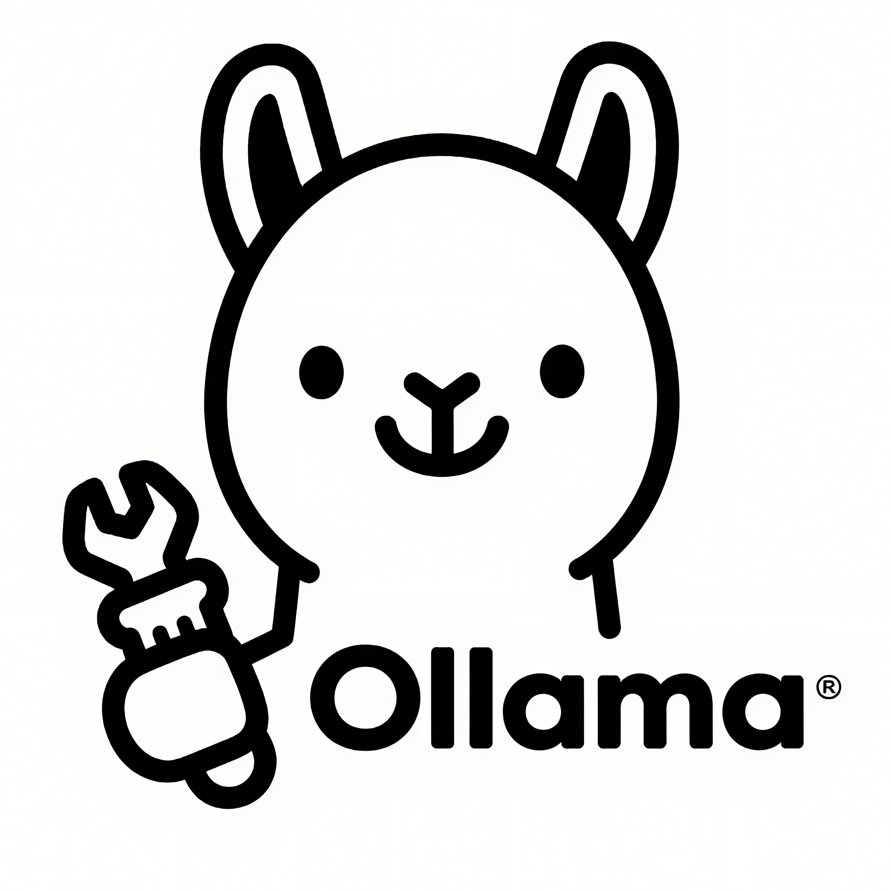

<div align="center">
  
  
  # 🦙 Ollama Tools
  
  **专业的 Ollama 模型管理桌面应用程序**
  
  [](https://opensource.org/licenses/MIT)
  [](https://golang.org/)
  [](https://wails.io/)
  [](https://vuejs.org/)
  [](https://github.com/wailsapp/wails)
  
  [English](README.md) | [中文](README_zh.md)
  
</div>

## ✨ 功能特性

- 🌐 **多服务器支持** - 管理本地和多个远程 Ollama 服务器
- 🤖 **模型管理** - 查看、运行、停止和删除大语言模型
- ⚙️ **参数配置** - 配置模型参数（温度、topP、上下文大小等）
- 🔍 **智能搜索** - 根据名称、家族、标签等条件搜索模型
- 💬 **聊天界面** - 内置聊天界面用于模型测试
- 🎯 **提示词管理** - 组织和管理您的提示词
- 🔌 **OpenAI API 适配器** - 兼容 OpenAI API 生态系统
- 🎨 **现代化界面** - 基于 Vue.js 和现代设计原则构建的美观界面
- 🚀 **高性能** - 基于 Wails 框架的原生桌面性能

## 📸 界面截图

<div align="center">
  
  <p><em>主界面 - 模型管理</em></p>
</div>

<div align="center">
  
  <p><em>聊天界面 - 交互式测试</em></p>
</div>

## 🚀 快速开始

### 环境要求

- **Go** 1.24+ ([下载](https://golang.org/dl/))
- **Node.js** 18+ ([下载](https://nodejs.org/))
- **Wails CLI** ([安装指南](https://wails.io/docs/gettingstarted/installation))
- **Ollama** ([安装指南](https://ollama.ai/))

### 安装方式

#### 方式一：下载预编译版本

1. 前往 [Releases](https://github.com/your-username/tools-ollama/releases)
2. 下载适合您平台的版本
3. 解压并运行可执行文件

#### 方式二：从源码构建

```bash
# 克隆仓库
git clone https://github.com/your-username/tools-ollama.git
cd tools-ollama

# 安装前端依赖
cd frontend
npm install
cd ..

# 构建应用程序
wails build

# 构建的应用程序将位于 build/bin 目录中
```

### 开发环境

```bash
# 克隆仓库
git clone https://github.com/your-username/tools-ollama.git
cd tools-ollama

# 安装依赖
cd frontend
npm install
cd ..

# 运行开发模式
wails dev
```

## 🛠️ 配置说明

### Ollama 服务器设置

1. **本地 Ollama**：在您的机器上安装 Ollama
2. **远程 Ollama**：在设置中配置远程服务器端点
3. **API 访问**：确保 Ollama API 可访问（默认：`http://localhost:11434`）

### 首次运行

1. 启动应用程序
2. 前往 **设置** → **Ollama 设置**
3. 添加您的 Ollama 服务器
4. 开始探索和管理您的模型！

## 📚 文档

- [用户指南](docs/user-guide_zh.md) - 完整用户手册
- [API 文档](docs/api_zh.md) - API 参考
- [开发指南](docs/development_zh.md) - 贡献者指南
- [故障排除](docs/troubleshooting_zh.md) - 常见问题和解决方案

## 🏗️ 项目架构

```
tools-ollama/
├── 📁 frontend/          # Vue.js 前端应用程序
│   ├── src/
│   │   ├── views/        # 页面组件
│   │   ├── components/   # 可复用组件
│   │   ├── stores/       # Pinia 状态管理
│   │   └── assets/       # 静态资源
│   └── package.json
├── 📁 docs/              # 文档
├── 📄 main.go            # 应用程序入口点
├── 📄 app.go             # 主应用程序逻辑
├── 📄 model_manager.go   # 模型管理
├── 📄 chat_manager.go    # 聊天功能
├── 📄 ollama_config.go   # 配置管理
├── 📄 wails.json         # Wails 配置
└── 📄 go.mod             # Go 依赖
```

## 🤝 贡献

我们欢迎贡献！请查看我们的[贡献指南](CONTRIBUTING_zh.md)了解详情。

### 开发设置

1. Fork 仓库
2. 创建您的功能分支 (`git checkout -b feature/amazing-feature`)
3. 提交您的更改 (`git commit -m 'Add some amazing feature'`)
4. 推送到分支 (`git push origin feature/amazing-feature`)
5. 打开一个 Pull Request

### 代码规范

- **Go**：遵循标准 Go 约定并使用 `gofmt`
- **Vue.js**：使用 TypeScript 并遵循 Vue 3 Composition API 模式
- **提交**：使用[约定式提交](https://conventionalcommits.org/)

## 🐛 错误报告和功能请求

- **错误报告**：[创建 Issue](https://github.com/your-username/tools-ollama/issues/new?template=bug_report.md)
- **功能请求**：[创建 Issue](https://github.com/your-username/tools-ollama/issues/new?template=feature_request.md)
- **问题讨论**：[开始讨论](https://github.com/your-username/tools-ollama/discussions)

## 📋 路线图

- [ ] **模型市场** - 从社区浏览和安装模型
- [ ] **插件系统** - 通过插件扩展功能
- [ ] **云同步** - 跨设备同步配置
- [ ] **高级分析** - 模型使用统计和洞察
- [ ] **团队协作** - 共享模型和配置
- [ ] **移动应用** - 配套移动应用程序

## 🙏 致谢

- [Ollama](https://ollama.ai/) - 提供出色的本地 LLM 运行时
- [Wails](https://wails.io/) - 提供优秀的 Go + Web 桌面框架
- [Vue.js](https://vuejs.org/) - 提供响应式前端框架
- [Element Plus](https://element-plus.org/) - 提供美观的 UI 组件

## 📄 许可证

本项目采用 MIT 许可证 - 查看 [LICENSE](LICENSE) 文件了解详情。

## 🌟 Star 历史

[](https://star-history.com/#your-username/tools-ollama&Date)

---

<div align="center">
  <p>由 Ollama Tools 团队用 ❤️ 制作</p>
  <p>
    <a href="https://github.com/your-username/tools-ollama">GitHub</a> •
    <a href="https://github.com/your-username/tools-ollama/issues">Issues</a> •
    <a href="https://github.com/your-username/tools-ollama/discussions">Discussions</a>
  </p>
</div>