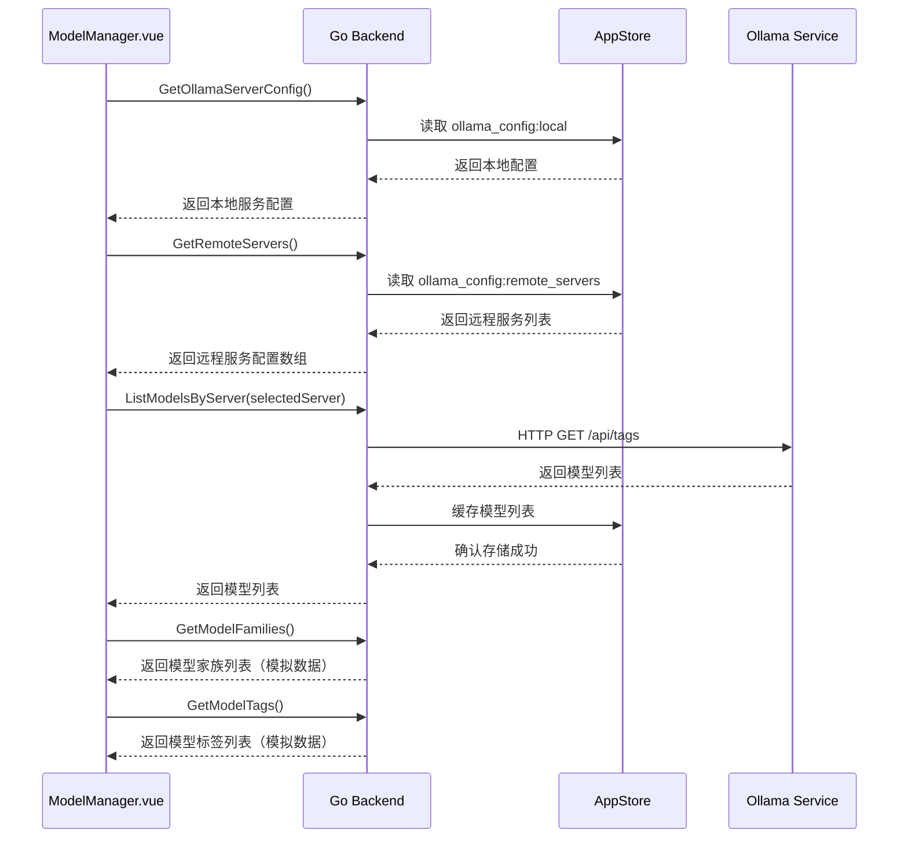
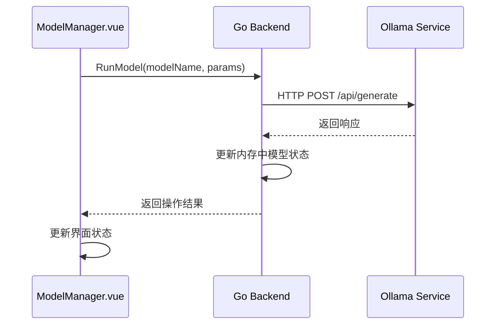
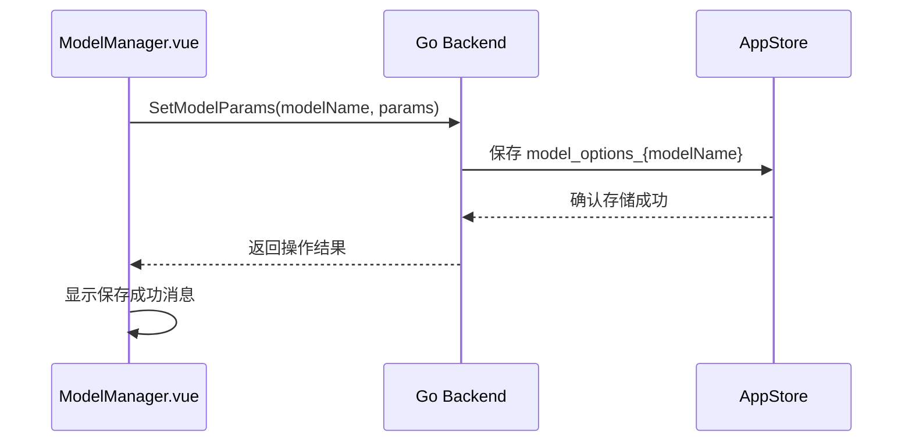
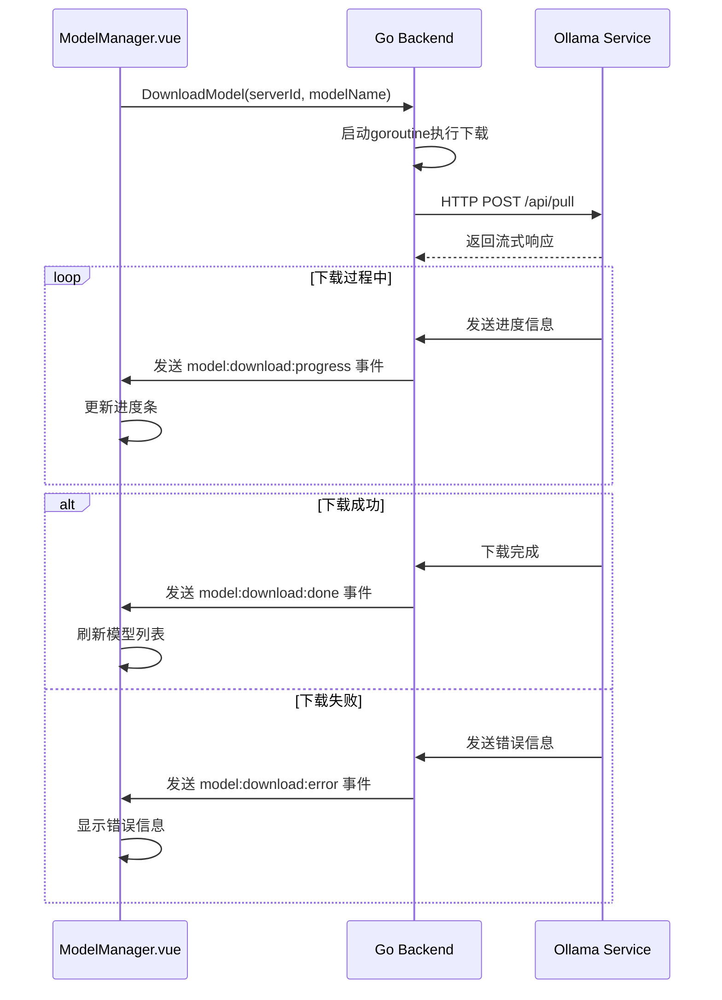
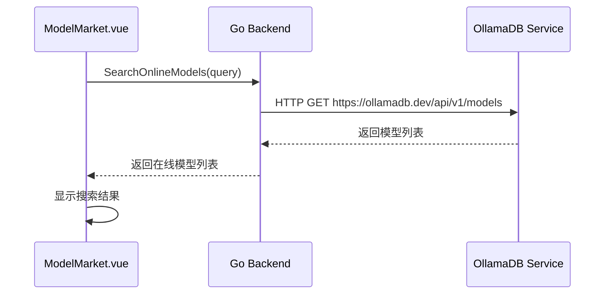

# ModelManager 页面数据结构

## 前端数据结构

### Model 接口

```typescript
interface Model {
  name: string;              // 模型名称
  size: number;              // 模型大小（字节）
  modified_at: string;       // 修改时间（ISO格式）
  is_running?: boolean;      // 运行状态
}
```

### Server 接口

```typescript
interface Server {
  id: string;                // 服务器ID
  name: string;              // 服务器名称
  baseUrl: string;           // 基础URL
  apiKey: string;            // API密钥
  isActive: boolean;         // 是否为活动服务器
}
```

### ModelParams 接口

```typescript
interface ModelParams {
  temperature: number;       // 温度参数 (0-1)
  topP: number;              // Top P参数 (0-1)
  topK: number;              // Top K参数
  context: number;           // 上下文大小 (1-32768)
  numPredict: number;        // 预测数量
  repeatPenalty: number;     // 重复惩罚
}
```

### OnlineModel 接口

```typescript
interface OnlineModel {
  name: string;              // 模型名称
  pull_count: number;        // 下载次数
  updated_at: string;        // 更新时间
  description?: string;      // 模型描述
}
```

## 前端状态管理

### 响应式数据

```typescript
// 模型列表
const localModels = ref<Model[]>([])

// 选中的模型
const selectedModel = ref<Model | null>(null)

// 加载状态
const loading = ref(false)

// 可用服务器列表
const availableServers = ref<Server[]>([])

// 选中的服务器
const selectedServer = ref<string>('local')

// 详情抽屉可见性
const drawerVisible = ref(false)

// 搜索抽屉可见性
const searchDrawerVisible = ref(false)

// 搜索模型查询关键词
const searchModelQuery = ref('')

// 搜索结果
const searchResults = ref<Model[]>([])

// 活动的折叠面板
const activeNames = ref([])

// 下载状态
const downloading = ref(false)

// 下载进度
const downloadProgress = ref(0)

// 模型参数
const modelParams = reactive<ModelParams>({
  temperature: 0.8,
  topP: 0.9,
  topK: 40,
  context: 2048,
  numPredict: 512,
  repeatPenalty: 1.1
})

// 在线模型列表
const onlineModels = ref<OnlineModel[]>([])

// 在线模型加载状态
const loadingOnlineModels = ref(false)
```

### 计算属性

```typescript
// 模型分组
const modelGroups = computed(() => {
  const groups: { name: string; models: Model[] }[] = []
  const groupMap: { [key: string]: Model[] } = {}
  
  searchResults.value.forEach(model => {
    // 以模型名称的第一部分作为分组依据（例如：llama3:8b 中的 llama3）
    const groupName = model.name.split(':')[0]
    if (!groupMap[groupName]) {
      groupMap[groupName] = []
    }
    groupMap[groupName].push(model)
  })
  
  Object.keys(groupMap).forEach(key => {
    groups.push({
      name: key,
      models: groupMap[key]
    })
  })
  
  return groups
})
```

## 后端数据结构

### Model 结构体

```go
// Model 模型信息
type Model struct {
    Name       string                 `json:"name"`
    Model      string                 `json:"model"`
    ModifiedAt string                 `json:"modified_at"`
    Size       int64                  `json:"size"`
    Digest     string                 `json:"digest"`
    Details    map[string]interface{} `json:"details"`
}
```

### OllamaServerConfig 结构体

```go
// OllamaServerConfig Ollama服务器配置
type OllamaServerConfig struct {
    ID         string `json:"id"`
    Name       string `json:"name"`
    BaseURL    string `json:"base_url"`
    APIKey     string `json:"api_key"`
    IsActive   bool   `json:"is_active"` 
    TestStatus string `json:"test_status"`
}
```

### ModelParams 结构体

```go
// ModelParams 模型参数
type ModelParams struct {
    Temperature   float64 `json:"temperature"`
    TopP          float64 `json:"top_p"`
    TopK          int     `json:"top_k"`
    Context       int     `json:"context"`
    NumPredict    int     `json:"num_predict"`
    RepeatPenalty float64 `json:"repeat_penalty"`
}
```

### OnlineModel 结构体

```go
// OnlineModel 在线模型信息
type OnlineModel struct {
    Name        string `json:"name"`
    PullCount   int64  `json:"pull_count"`
    UpdatedAt   string `json:"updated_at"`
    Description string `json:"description"`
}
```

## 数据存储设计

### 本地存储键名

1. **模型列表缓存**
   - 键名：`models_cache`
   - 内容：模型列表的JSON字符串
   - 用途：提高模型列表加载速度

2. **模型参数配置**
   - 键名：`model_options_{modelName}`
   - 内容：模型参数的JSON字符串
   - 用途：保存各模型的运行参数

### 存储示例

#### 模型列表缓存存储
```json
Key: models_cache
Value: {
  "models": [
    {
      "name": "llama3:8b",
      "model": "llama3:8b",
      "modified_at": "2024-01-01T12:00:00Z",
      "size": 4670000000,
      "digest": "sha256:abc123",
      "details": {}
    }
  ]
}
```

#### 模型参数配置存储
```json
Key: model_options_llama3:8b
Value: {
  "temperature": 0.8,
  "top_p": 0.9,
  "top_k": 40,
  "context": 2048,
  "num_predict": 512,
  "repeat_penalty": 1.1
}
```

## 数据流设计

### 页面初始化数据流



### 模型运行数据流



### 模型参数保存数据流



### 模型下载数据流



### 在线模型搜索数据流



## 数据验证规则

### 前端验证规则

1. **模型参数**
   - temperature: 0.0-1.0
   - topP: 0.0-1.0
   - context: 1-32768
   - topK: 正整数
   - numPredict: 正整数
   - repeatPenalty: 正数

2. **模型名称**
   - 非空验证
   - 长度限制：1-100个字符

3. **服务器配置**
   - URL格式验证
   - 必填字段验证

### 后端验证规则

1. **模型操作**
   - 模型存在性验证
   - 模型状态验证（运行/停止状态）
   - 参数范围验证

2. **服务器操作**
   - 服务器可达性验证
   - 服务器配置有效性验证

3. **参数验证**
   - 类型验证
   - 范围验证
   - 必填字段验证

4. **在线模型搜索**
   - 搜索关键词长度验证
   - 搜索结果数量限制

## 数据同步机制

### 页面间数据同步
- 通过服务器配置与 OllamaSettings 页面保持同步
- 模型状态在页面刷新时重置
- 通过 API 调用保持与 Ollama 服务状态同步

### 应用重启数据恢复
- 服务器配置持久化存储在本地数据库中
- 模型参数配置持久化存储
- 模型列表缓存（临时存储，应用重启后需要重新获取）

## 错误处理

### 数据相关错误

1. **存储读取失败**
   - 返回默认值而非报错
   - 记录错误日志
   - 提示用户可能的配置丢失

2. **存储写入失败**
   - 显示错误消息
   - 保持界面状态
   - 提供重试机制

3. **数据格式错误**
   - 尝试修复或重置数据
   - 记录错误日志
   - 必要时提示用户

### 网络相关错误

1. **模型列表获取失败**
   - 显示错误消息
   - 保持现有列表或显示空状态
   - 提供刷新重试按钮

2. **模型操作失败**
   - 显示具体错误信息
   - 保持界面状态一致性
   - 提供重试机制

3. **服务器连接失败**
   - 显示连接错误信息
   - 建议检查服务器配置
   - 提供跳转到配置页面的链接（待实现）

4. **在线模型搜索失败**
   - 显示搜索失败消息
   - 保持现有在线模型列表
   - 提供重试搜索按钮