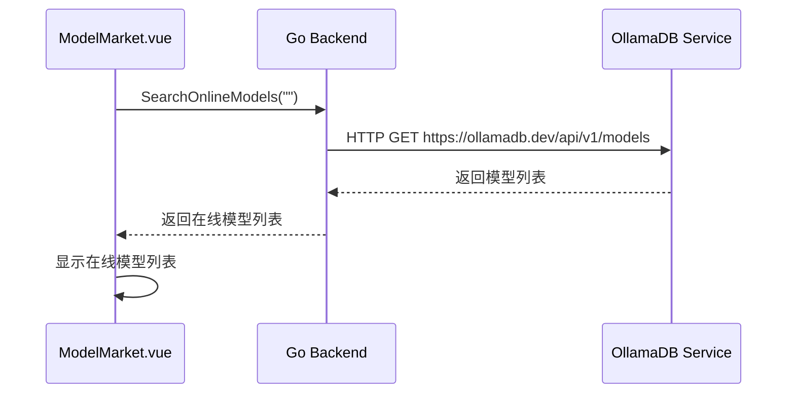
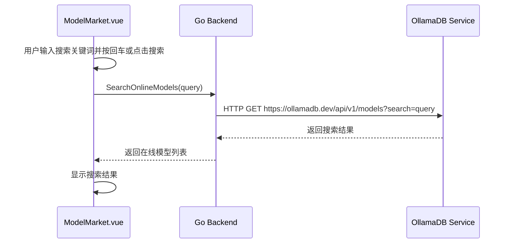

# ModelMarket 页面数据结构

## 前端数据结构

### OnlineModel 接口

```typescript
interface OnlineModel {
  model_identifier: string;   // 模型标识
  namespace: string | null;   // 命名空间
  model_name: string;         // 模型名称
  model_type: string;         // 模型类型
  description: string;        // 模型描述
  capability: string | null;  // 模型能力
  labels: string[];           // 标签
  pulls: number;              // 下载次数
  tags: number;               // 标签数量
  last_updated: string;       // 最后更新日期
  last_updated_str: string;   // 最后更新时间描述
  url: string;                // 模型详情页面URL
}
```

### MarketModel 接口

```typescript
interface MarketModel {
  name: string;              // 模型名称
  description: string;       // 模型描述
  size: number;              // 模型大小（字节）
  tags?: string[];           // 模型标签
}
```

### SearchResult 接口

```typescript
interface SearchResult {
  name: string;              // 模型名称
  pull_count: number;        // 下载次数
  updated_at: string;        // 更新时间（ISO格式）
  description?: string;      // 模型描述（可选）
}
```

## 后端数据结构

### OnlineModel 结构体

```go
// OnlineModel 在线模型信息
type OnlineModel struct {
    Name        string `json:"name"`
    PullCount   int64  `json:"pull_count"`
    UpdatedAt   string `json:"updated_at"`
    Description string `json:"description"`
}
```

## 状态管理

### 响应式数据

```typescript
// 搜索关键词
const searchText = ref('')

// 在线模型列表
const onlineModels = ref<OnlineModel[]>([])

// 在线模型加载状态
const loading = ref(false)

// 模型详情抽屉可见性
const drawerVisible = ref(false)

// 选中的模型
const selectedModel = ref<OnlineModel | null>(null)
```

## 数据存储设计

### 本地存储键名

ModelMarket 页面不直接使用本地存储，所有数据都通过 API 实时获取。

## 数据流设计

### 页面初始化数据流



### 模型搜索数据流



```

## 数据验证规则

### 前端验证规则

1. **搜索关键词**
   - 长度限制：1-100个字符

2. **模型名称**
   - 非空验证
   - 长度限制：1-100个字符

### 后端验证规则

1. **搜索参数**
   - 搜索关键词长度验证
   - 搜索结果数量限制

2. **下载参数**
   - 服务器ID有效性验证
   - 模型名称有效性验证

## 数据同步机制

### 页面间数据同步
- 通过 API 调用保持与 OllamaDB 服务数据同步
- 模型下载完成后通知 ModelManager 刷新模型列表

### 应用重启数据恢复
- 所有数据通过 API 实时获取
- 无本地持久化状态需要恢复

## 错误处理

### 数据相关错误

1. **API调用失败**
   - 显示错误消息
   - 提供重试机制
   - 保持现有数据展示

2. **数据格式错误**
   - 记录错误日志
   - 显示友好的错误提示

### 网络相关错误

1. **搜索失败**
   - 显示搜索失败消息
   - 保持现有在线模型列表
   - 提供重试搜索按钮

2. **下载失败**
   - 显示下载失败消息
   - 提供重试下载按钮
   - 详细记录错误原因