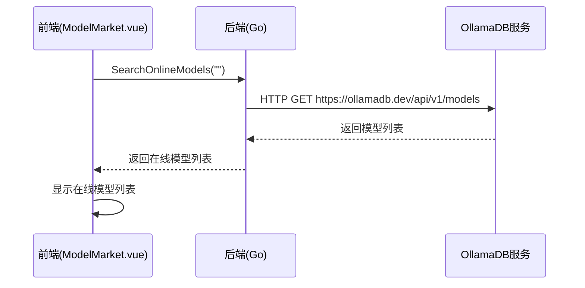
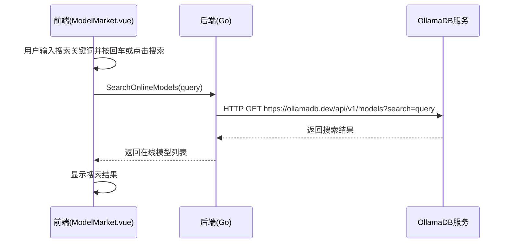
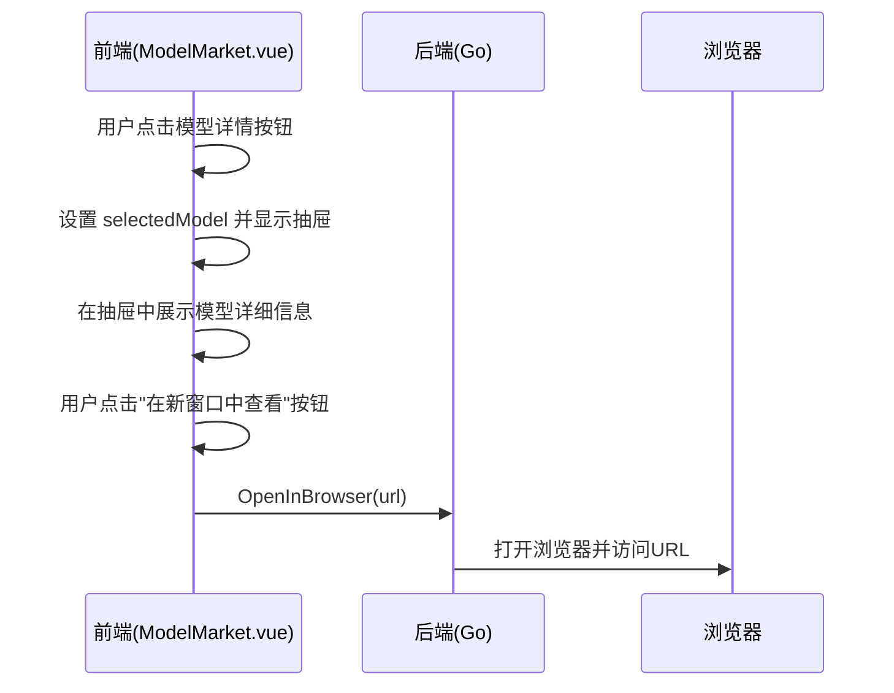

# ModelMarket 页面 API 接口文档

## 接口概览

ModelMarket 页面通过 Wails 框架提供的绑定机制与 Go 后端进行通信，实现在线模型发现和浏览功能。所有接口均通过 `../../wailsjs/go/main/App` 导入。

## 接口列表

### 1. SearchOnlineModels

搜索在线模型。

**前端调用**：
```typescript
import { SearchOnlineModels } from '../../wailsjs/go/main/App'

SearchOnlineModels(query: string): Promise<OnlineModel[]>
```

**参数说明**：

| 参数名 | 类型 | 必填 | 说明 |
|--------|------|------|------|
| query | string | 是 | 搜索关键词 |

**返回值说明**：

| 类型 | 说明 |
|------|------|
| OnlineModel[] | 在线模型数组 |

**后端实现**：
```go
// SearchOnlineModels 搜索在线模型
func (a *App) SearchOnlineModels(query string) ([]interface{}, error) {
    return a.modelMarket.SearchOnlineModels(query)
}
```

**ModelMarket.SearchOnlineModels 实现**：
```go
// SearchOnlineModels 在 ollamadb.dev 上搜索模型
func (m *ModelMarket) SearchOnlineModels(query string) ([]interface{}, error) {
    logger := core.NewLogger(&core.LoggerOption{Type: "console", Level: "debug", Prefix: "SearchClient"})
    searchClient := core.NewHttp(logger)

    resp, err := searchClient.Get("https://ollamadb.dev/api/v1/models", core.Options{
        Query: map[string]string{
            "search": query,
        },
    })
    if err != nil {
        return nil, fmt.Errorf("搜索模型失败: %w", err)
    }

    if resp.StatusCode != http.StatusOK {
        return nil, fmt.Errorf("搜索模型失败: 状态码 %d", resp.StatusCode)
    }

    var searchResult map[string]interface{}
    err = json.Unmarshal([]byte(resp.Body), &searchResult)
    if err != nil {
        return nil, fmt.Errorf("解析搜索结果失败: %w", err)
    }

    models, ok := searchResult["models"].([]interface{})
    if !ok {
        return nil, fmt.Errorf("在搜索结果中找不到模型")
    }

    return models, nil
}
```

**错误处理**：
- 网络连接失败时返回错误
- HTTP状态码错误时返回错误
- JSON解析失败时返回错误

### 2. OpenInBrowser

在系统默认浏览器中打开指定URL。

**前端调用**：
```typescript
import { OpenInBrowser } from '../../wailsjs/go/main/App'

OpenInBrowser(url: string): Promise<void>
```

**参数说明**：

| 参数名 | 类型 | 必填 | 说明 |
|--------|------|------|------|
| url | string | 是 | 要打开的URL |

**后端实现**：
```go
// OpenInBrowser 在浏览器中打开URL
func (a *App) OpenInBrowser(url string) error {
    return core.OpenInBrowser(url)
}
```

**错误处理**：
- 浏览器打开失败时返回错误

## 接口调用时序

### 页面加载时序


### 搜索模型时序


### 查看模型详情时序


## 错误处理规范

### 前端错误处理
1. 所有异步调用都应使用 try/catch 包装
2. 错误信息应通过 ElMessage 显示给用户
3. 网络错误应提供重试机制
4. 浏览器打开失败应提示用户手动访问链接

### 后端错误处理
1. 所有接口都应返回 error 类型
2. 错误信息应包含具体原因
3. 对于用户可处理的错误，应提供明确的处理建议
4. 错误信息应包含错误代码以便前端处理

### 网络超时处理
1. 设置合理的超时时间（建议10秒）
2. 超时错误应提示用户检查网络连接
3. 提供重试按钮

## 数据一致性保证

### 读写一致性
1. 所有写操作完成后立即刷新读取
2. 使用乐观锁机制防止并发写冲突
3. 关键操作记录操作日志

### 状态同步
1. 页面间通过事件机制同步状态变化
2. 应用重启后从存储中恢复状态
3. 多设备间通过云同步保持一致