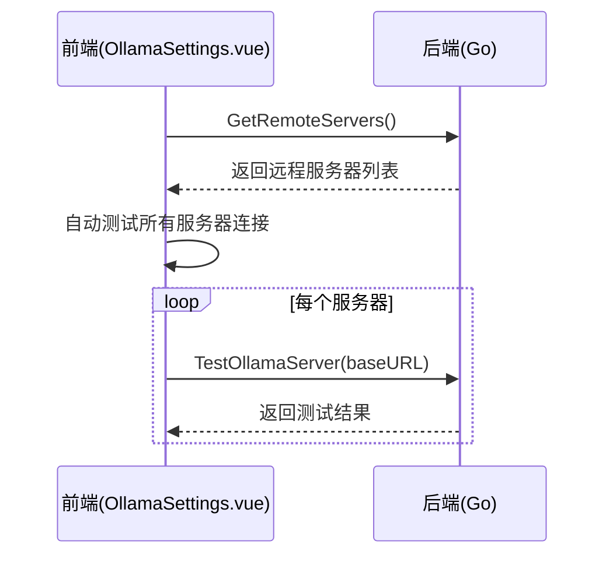
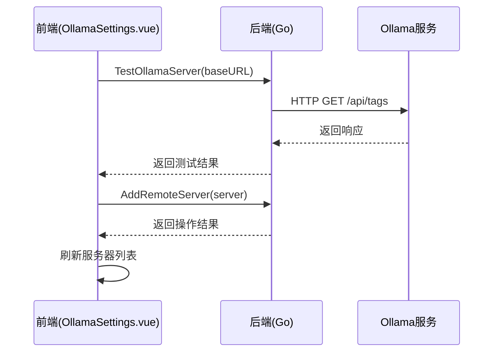
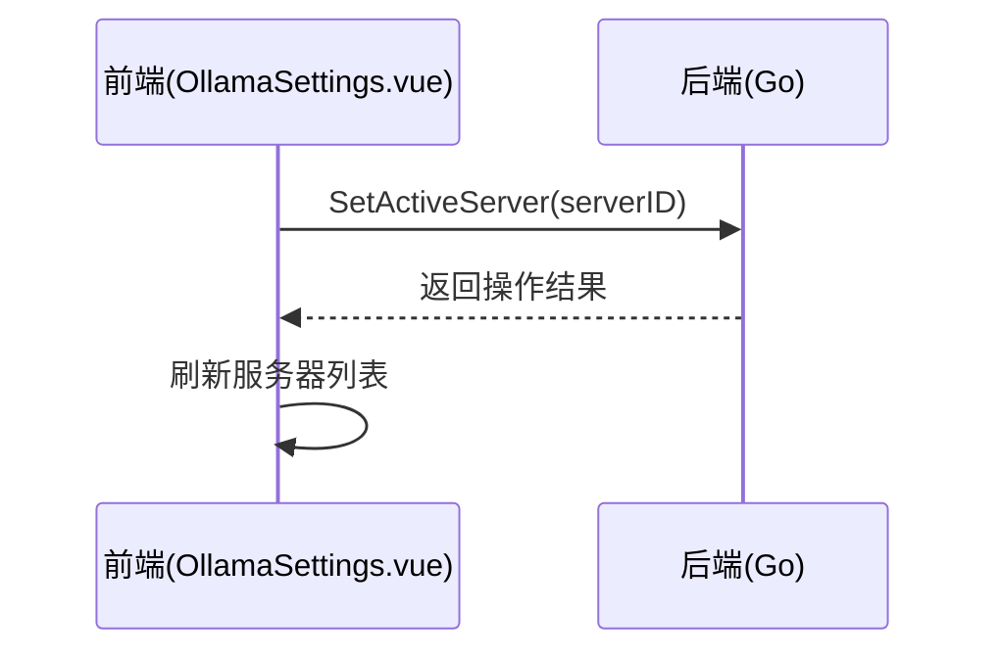

# OllamaSettings 页面 API 接口文档

## 接口概览

OllamaSettings 页面通过 Wails 框架提供的绑定机制与 Go 后端进行通信，实现服务配置的管理功能。

## 接口列表

### 1. SaveOllamaServerConfig

保存本地 Ollama 服务配置。

**前端调用**：
```typescript
import { SaveOllamaServerConfig } from '../../wailsjs/go/main/App'

SaveOllamaServerConfig(baseUrl: string): Promise<void>
```

**参数说明**：
| 参数名 | 类型 | 必填 | 说明 |
|--------|------|------|------|
| baseUrl | string | 是 | 本地 Ollama 服务的基础 URL |

**后端实现**：
```go
// SaveOllamaServerConfig 保存Ollama服务器配置
func (a *App) SaveOllamaServerConfig(baseUrl string) error {
    // 更新HTTP客户端的基础URL
    a.httpClient.Create(&core.Config{
        BaseURL: baseUrl,
    })

    // 保存到存储中
    return a.configMgr.SaveLocalConfig(baseUrl)
}
```

**错误处理**：
- 存储失败时返回错误
- 网络配置失败时返回错误

### 2. GetOllamaServerConfig

获取本地 Ollama 服务配置。

**前端调用**：
```typescript
import { GetOllamaServerConfig } from '../../wailsjs/go/main/App'

GetOllamaServerConfig(): Promise<string>
```

**返回值说明**：
| 类型 | 说明 |
|------|------|
| string | 本地 Ollama 服务的基础 URL |

**后端实现**：
```go
// GetOllamaServerConfig 获取Ollama服务器配置
func (a *App) GetOllamaServerConfig() (string, error) {
    url, err := a.configMgr.GetLocalConfig()
    if err != nil {
        // 返回默认URL
        return "http://localhost:11434", nil
    }
    return url, nil
}
```

**错误处理**：
- 配置不存在时返回默认值 "http://localhost:11434"
- 其他错误时返回默认值而非报错

### 3. SaveRemoteServers

保存远程服务器列表。

**前端调用**：
```typescript
import { SaveRemoteServers } from '../../wailsjs/go/main/App'

SaveRemoteServers(servers: OllamaServerConfig[]): Promise<void>
```

**参数说明**：
| 参数名 | 类型 | 必填 | 说明 |
|--------|------|------|------|
| servers | OllamaServerConfig[] | 是 | 远程服务器配置数组 |

**后端实现**：
```go
// SaveRemoteServers 保存远程服务器列表
func (a *App) SaveRemoteServers(servers []OllamaServerConfig) error {
    return a.configMgr.SaveRemoteServers(servers)
}
```

**错误处理**：
- 序列化失败时返回错误
- 存储失败时返回错误

### 4. GetRemoteServers

获取远程服务器列表。

**前端调用**：
```typescript
import { GetRemoteServers } from '../../wailsjs/go/main/App'

GetRemoteServers(): Promise<OllamaServerConfig[]>
```

**返回值说明**：
| 类型 | 说明 |
|------|------|
| OllamaServerConfig[] | 远程服务器配置数组 |

**后端实现**：
```go
// GetRemoteServers 获取远程服务器列表
func (a *App) GetRemoteServers() ([]OllamaServerConfig, error) {
    return a.configMgr.GetRemoteServers()
}
```

**错误处理**：
- 配置不存在时返回空数组
- 反序列化失败时返回空数组

### 5. AddRemoteServer

添加远程服务器。

**前端调用**：
```typescript
import { AddRemoteServer } from '../../wailsjs/go/main/App'

AddRemoteServer(server: OllamaServerConfig): Promise<void>
```

**参数说明**：
| 参数名 | 类型 | 必填 | 说明 |
|--------|------|------|------|
| server | OllamaServerConfig | 是 | 要添加的远程服务器配置 |

**后端实现**：
```go
// AddRemoteServer 添加远程服务器
func (a *App) AddRemoteServer(server OllamaServerConfig) error {
    return a.configMgr.AddRemoteServer(server)
}
```

**错误处理**：
- 存储失败时返回错误
- 参数验证失败时返回错误

### 6. UpdateRemoteServer

更新远程服务器。

**前端调用**：
```typescript
import { UpdateRemoteServer } from '../../wailsjs/go/main/App'

UpdateRemoteServer(server: OllamaServerConfig): Promise<void>
```

**参数说明**：
| 参数名 | 类型 | 必填 | 说明 |
|--------|------|------|------|
| server | OllamaServerConfig | 是 | 更新后的远程服务器配置 |

**后端实现**：
```go
// UpdateRemoteServer 更新远程服务器
func (a *App) UpdateRemoteServer(server OllamaServerConfig) error {
    return a.configMgr.UpdateRemoteServer(server)
}
```

**错误处理**：
- 服务器不存在时返回错误
- 存储失败时返回错误

### 7. DeleteRemoteServer

删除远程服务器。

**前端调用**：
```typescript
import { DeleteRemoteServer } from '../../wailsjs/go/main/App'

DeleteRemoteServer(serverID: string): Promise<void>
```

**参数说明**：
| 参数名 | 类型 | 必填 | 说明 |
|--------|------|------|------|
| serverID | string | 是 | 要删除的远程服务器ID |

**后端实现**：
```go
// DeleteRemoteServer 删除远程服务器
func (a *App) DeleteRemoteServer(serverID string) error {
    return a.configMgr.DeleteRemoteServer(serverID)
}
```

**错误处理**：
- 服务器不存在时返回错误
- 存储失败时返回错误

### 8. SetActiveServer

设置活动服务器。

**前端调用**：
```typescript
import { SetActiveServer } from '../../wailsjs/go/main/App'

SetActiveServer(serverID: string): Promise<void>
```

**参数说明**：
| 参数名 | 类型 | 必填 | 说明 |
|--------|------|------|------|
| serverID | string | 是 | 要设置为活动状态的服务器ID |

**后端实现**：
```go
// SetActiveServer 设置活动服务器
func (a *App) SetActiveServer(serverID string) error {
    return a.configMgr.SetActiveServer(serverID)
}
```

**错误处理**：
- 服务器不存在时返回错误
- 存储失败时返回错误

### 9. TestOllamaServer

测试 Ollama 服务器连接。

**前端调用**：
```typescript
import { TestOllamaServer } from '../../wailsjs/go/main/App'

TestOllamaServer(baseURL: string): Promise<void>
```

**参数说明**：
| 参数名 | 类型 | 必填 | 说明 |
|--------|------|------|------|
| baseURL | string | 是 | 要测试的服务器基础URL |

**后端实现**：
```go
// TestOllamaServer 测试Ollama服务器是否可达
func (a *App) TestOllamaServer(baseURL string) error {
    // 为测试创建临时的HTTP客户端
    tempClient := core.NewHttp(core.NewLogger(&core.LoggerOption{
        Type:   "console",
        Level:  "debug",
        Prefix: "TestClient",
    }))

    tempClient.Create(&core.Config{
        BaseURL: baseURL,
    })

    // 尝试访问/tags端点来验证服务器是否可达
    _, err := tempClient.Get("/api/tags", core.Options{})
    if err != nil {
        return fmt.Errorf("无法连接到Ollama服务器: %w", err)
    }

    return nil
}
```

**错误处理**：
- 连接失败时返回详细错误信息
- HTTP状态码错误时返回错误

## 接口调用时序

### 页面加载时序


### 添加服务器时序


### 设置默认服务器时序


## 错误处理规范

### 前端错误处理
1. 所有异步调用都应使用 try/catch 包装
2. 错误信息应通过 ElMessage 显示给用户
3. 网络错误应提供重试机制

### 后端错误处理
1. 所有接口都应返回 error 类型
2. 错误信息应包含具体原因
3. 对于用户可处理的错误，应提供明确的处理建议

### 网络超时处理
1. 设置合理的超时时间（建议10秒）
2. 超时错误应提示用户检查网络连接
3. 提供重试按钮

## 数据一致性保证

### 读写一致性
1. 所有写操作完成后立即刷新读取
2. 使用乐观锁机制防止并发写冲突
3. 关键操作记录操作日志

### 状态同步
1. 页面间通过事件机制同步状态变化
2. 应用重启后从存储中恢复状态
3. 多设备间通过云同步保持一致