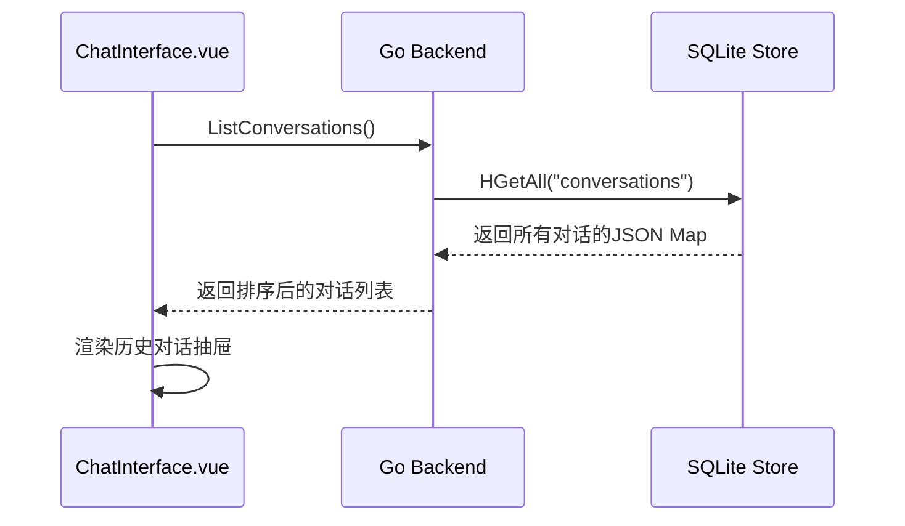
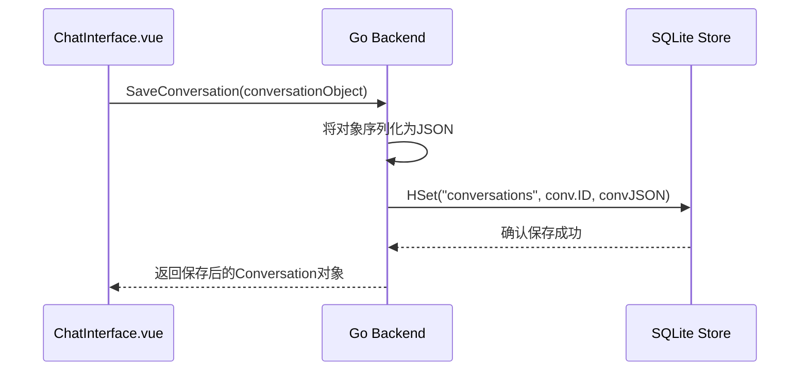

# ChatManager 数据结构

## 前端数据结构 (TypeScript)

### Conversation 接口
```typescript
interface Conversation {
  id: string;
  title: string;
  messages: Message[];
  modelName: string;
  systemPrompt: string; // JSON string of the active system prompt
  modelParams: string;  // JSON string of the model parameters
  timestamp: number;
}
```

### Message 接口

```typescript
interface Message {
  role: 'user' | 'assistant' | 'system';
  content: string;
  timestamp?: number;
}
```

### Server 接口 (用于模型选择)
```typescript
interface Server { 
  id: string; 
  name: string; 
  base_url: string; 
}
```

## 后端数据结构 (Go)

### Conversation 结构体

```go
// Conversation 定义了一个完整的对话会话
type Conversation struct {
	ID           string    `json:"id"`
	Title        string    `json:"title"`
	Messages     []Message `json:"messages"`
	ModelName    string    `json:"modelName"`
	SystemPrompt string    `json:"systemPrompt"`
	ModelParams  string    `json:"modelParams"`
	Timestamp    int64     `json:"timestamp"`
}
```

### Message 结构体

```go
// Message 聊天消息结构
type Message struct {
    Role    string `json:"role"`
    Content string `json:"content"`
}
```

## 数据存储设计

### 对话存储

- **存储方式**: 使用 `duolasdk` 提供的 `HSet`/`HGetAll` 等哈希(Hash)操作。
- **主键 (Key)**: 所有对话都存储在同一个哈希表中，其键名为 `"conversations"`。
- **字段 (Field)**: 哈希表中的每个字段是对应对话的 `ConversationID` (一个UUID字符串)。
- **值 (Value)**: 每个字段的值是将 `Conversation` 对象完整序列化后的JSON字符串。

### 存储示例

```
Key: "conversations"
Field: "a1b2c3d4-e5f6-g7h8-i9j0-k1l2m3n4o5p6"
Value: "{\"id\":\"a1b2...\",\"title\":\"Python冒泡排序\",\"messages\":[...],...}"
```

## 数据流设计

### 加载历史对话数据流



### 保存/更新对话数据流


