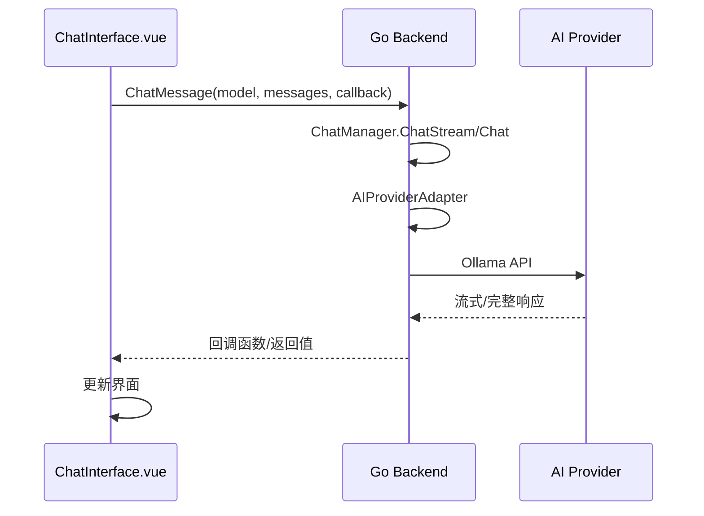
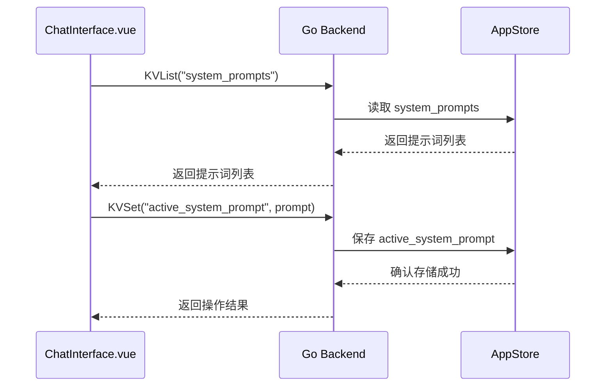

# ChatManager 数据结构

## 前端数据结构

### Message 接口

```typescript
interface Message {
  role: 'user' | 'assistant' | 'system';  // 消息角色
  content: string;                        // 消息内容
  timestamp?: number;                     // 消息时间戳
}
```

### ModelParams 接口

```typescript
interface ModelParams {
  temperature: number;       // 温度参数 (0-1)
  topP: number;              // Top P参数 (0-1)
  context: number;           // 上下文大小 (1-32768)
  numPredict: number;        // 预测数量
  topK: number;              // Top K参数
  repeatPenalty: number;     // 重复惩罚
  outputMode: 'stream' | 'blocking'; // 输出方式
}
```

### SystemPrompt 接口

```typescript
interface SystemPrompt {
  id: string;                // 提示词ID
  title: string;             // 提示词标题
  prompt: string;            // 提示词内容
  createdAt: number;         // 创建时间戳
}
```

## 后端数据结构

### Message 结构体

```go
// Message 聊天消息结构
type Message struct {
    Role    string `json:"role"`    // 消息角色
    Content string `json:"content"` // 消息内容
}
```

### ChatManager 结构体

```go
// ChatManager 聊天管理器
type ChatManager struct {
    aiProvider aiProvider      // AI提供者接口
    logger     *core.AppLog    // 日志记录器
}
```

### AI提供者接口

```go
type aiProvider interface {
    Chat(model string, messages []Message) (string, error)
    ChatStream(model string, messages []Message, callback func(string)) error
}
```

### AIProviderAdapter 结构体

```go
// AIProviderAdapter 适配器，用于解决core.Message和本地Message类型不匹配的问题
type AIProviderAdapter struct {
    provider *core.OllamaProvider  // 核心Ollama提供者
    logger   *core.AppLog          // 日志记录器
}
```

## 状态管理

### 响应式数据

```typescript
// 聊天消息列表
const messages = ref<Message[]>([
  {role: 'assistant', content: '你好！我是Ollama助手，请选择一个模型开始对话。', timestamp: Date.now()}
])

// 输入消息内容
const inputMessage = ref('')

// 思考状态
const isThinking = ref(false)

// 系统提示词抽屉可见性
const systemPromptDrawerVisible = ref(false)

// 激活的系统提示词
const activeSystemPrompt = ref<SystemPrompt | null>(null)

// 系统提示词列表
const systemPromptList = ref<SystemPrompt[]>([])

// 模型参数
const modelParams = ref<ModelParams>({
  temperature: 0.8,
  topP: 0.9,
  context: 2048,
  numPredict: 512,
  topK: 40,
  repeatPenalty: 1.1,
  outputMode: 'stream'
})
```

## 数据存储设计

### 本地存储键名

1. **系统提示词列表**
   - 键名：`system_prompts`
   - 内容：系统提示词数组的JSON字符串

2. **激活的系统提示词**
   - 键名：`active_system_prompt`
   - 内容：当前激活的系统提示词JSON字符串

### 存储示例

#### 系统提示词存储
```json
Key: system_prompts
Value: [
  {
    "id": "1234567890",
    "title": "代码助手",
    "prompt": "你是一个专业的编程助手，请用简洁明了的方式回答技术问题。",
    "createdAt": 1700000000000
  }
]
```

#### 激活的系统提示词存储
```json
Key: active_system_prompt
Value: {
  "id": "1234567890",
  "title": "代码助手",
  "prompt": "你是一个专业的编程助手，请用简洁明了的方式回答技术问题。",
  "createdAt": 1700000000000
}
```

## 数据流设计

### 聊天消息发送数据流



### 系统提示词管理数据流



## 数据验证规则

### 前端验证规则

1. **消息内容**
   - 非空验证
   - 长度限制：1-4096个字符

2. **模型参数**
   - temperature: 0.0-1.0
   - topP: 0.0-1.0
   - context: 1-32768
   - numPredict: 1-4096
   - topK: 正整数
   - repeatPenalty: 正数
   - outputMode: 'stream' 或 'blocking'

3. **系统提示词**
   - 标题：1-100个字符
   - 内容：1-2048个字符

### 后端验证规则

1. **消息验证**
   - 消息角色有效性验证
   - 消息内容长度验证

2. **模型验证**
   - 模型名称非空验证
   - 模型存在性验证（通过AI提供者）

3. **提供者验证**
   - 提供者是否设置验证
   - 提供者连接状态验证

## 数据同步机制

### 页面间数据同步
- 系统提示词状态在页面刷新时从存储中恢复
- 激活的提示词状态持久化存储
- 聊天历史在会话期间保持

### 应用重启数据恢复
- 系统提示词配置持久化存储在本地数据库中
- 激活状态持久化存储
- 聊天历史在会话结束后丢失（暂不持久化）

## 错误处理

### 数据相关错误

1. **存储读取失败**
   - 返回默认值而非报错
   - 记录错误日志
   - 提示用户可能的配置丢失

2. **存储写入失败**
   - 显示错误消息
   - 保持界面状态
   - 提供重试机制

3. **数据格式错误**
   - 尝试修复或重置数据
   - 记录错误日志
   - 必要时提示用户

### 网络相关错误

1. **聊天请求失败**
   - 显示具体错误信息
   - 提供重试机制
   - 保持现有聊天历史

2. **提供者连接失败**
   - 显示连接错误信息
   - 建议检查提供者配置
   - 提供配置跳转链接

3. **流式传输中断**
   - 显示传输中断信息
   - 保持已接收部分
   - 提供重新发送选项