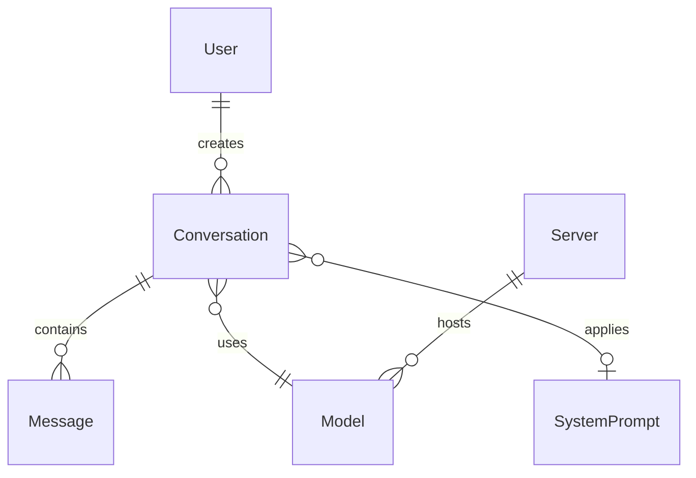

# ChatManager 数据结构设计

## 1. Architecture（架构设计）

### 1.1 数据流架构
ChatManager 采用单向数据流架构，确保数据的一致性和可预测性。

```
┌─────────────┐    ┌─────────────┐    ┌─────────────┐
│   前端UI    │───▶│  Vue Store  │───▶│  后端API    │
│  (Vue组件)  │    │ (Reactive)  │    │ (Go/Wails)  │
└─────────────┘    └─────────────┘    └─────────────┘
       ▲                   │                   │
       │                   ▼                   ▼
       │            ┌─────────────┐    ┌─────────────┐
       └────────────│  事件系统   │    │  数据持久化 │
                    │ (EventBus)  │    │ (SQLite)    │
                    └─────────────┘    └─────────────┘
```

### 1.2 数据层次结构
```
ChatManager 数据层
├── 会话状态 (Session State)
├── 消息数据 (Message Data)
├── 模型配置 (Model Config)
├── 服务器配置 (Server Config)
└── 用户偏好 (User Preferences)
```

## 2. Analysis（数据分析）

### 2.1 数据类型分析
- **实时数据**: 当前会话消息、模型状态、输入内容
- **持久化数据**: 对话历史、模型参数、系统配置
- **临时数据**: UI状态、加载状态、错误信息
- **配置数据**: 服务器列表、模型列表、系统提示词

### 2.2 数据关系分析


## 3. Architecture（数据结构定义）

### 3.1 核心数据结构

#### 3.1.1 消息结构 (Message)
```typescript
interface Message {
  role: 'user' | 'assistant' | 'system';
  content: string;
  timestamp: number;
}
```

**字段说明**:
- `role`: 消息角色，区分用户、助手和系统消息
- `content`: 消息内容，支持Markdown格式
- `timestamp`: 消息时间戳，用于排序和显示

**使用场景**:
- 聊天界面消息展示
- 对话历史存储
- API请求构建

#### 3.1.2 对话结构 (Conversation)
```typescript
interface Conversation {
  id: string;                    // 唯一标识符
  title: string;                 // 对话标题
  messages: Message[];           // 消息列表
  modelName: string;             // 使用的模型名称
  systemPrompt?: string;         // 系统提示词(JSON字符串)
  modelParams?: string;          // 模型参数(JSON字符串)
  timestamp: number;             // 创建/更新时间
}
```

**字段说明**:
- `id`: UUID格式的唯一标识符
- `title`: 自动生成或用户自定义的标题
- `messages`: 完整的消息历史记录
- `modelName`: 关联的AI模型名称
- `systemPrompt`: 序列化的系统提示词对象
- `modelParams`: 序列化的模型参数配置
- `timestamp`: 毫秒级时间戳

#### 3.1.3 模型参数结构 (ModelParams)
```typescript
interface ModelParams {
  temperature: number;           // 温度参数 (0.1-2.0)
  topP: number;                 // Top-P参数 (0.1-1.0)
  topK: number;                 // Top-K参数 (1-100)
  context: number;              // 上下文长度 (512-4096)
  numPredict: number;           // 预测长度 (128-2048)
  repeatPenalty: number;        // 重复惩罚 (0.5-2.0)
  outputMode: 'stream' | 'blocking'; // 输出模式
}
```

**默认值配置**:
```typescript
const DEFAULT_MODEL_PARAMS: ModelParams = {
  temperature: 0.8,
  topP: 0.9,
  topK: 40,
  context: 2048,
  numPredict: 512,
  repeatPenalty: 1.1,
  outputMode: 'stream'
};
```

#### 3.1.4 模型结构 (Model)
```typescript
interface Model {
  name: string;                  // 模型名称
  model: string;                 // 模型标识符
  size: number;                  // 模型大小(字节)
  modified_at: string;           // 修改时间
  digest: string;                // 模型摘要
  details?: object;              // 详细信息
  isRunning?: boolean;           // 运行状态
}
```

#### 3.1.5 服务器配置结构 (OllamaServerConfig)
```typescript
interface OllamaServerConfig {
  id: string;                    // 服务器ID
  name: string;                  // 服务器名称
  baseURL: string;               // 服务器地址
  isActive: boolean;             // 是否为活动服务器
  testStatus?: string;           // 连接测试状态
}
```

#### 3.1.6 系统提示词结构 (Prompt)
```typescript
interface Prompt {
  id: string;                    // 提示词ID
  name: string;                  // 提示词名称
  content: string;               // 提示词内容
  description?: string;          // 描述信息
  tags?: string[];               // 标签列表
  createdAt: number;             // 创建时间
  updatedAt: number;             // 更新时间
}
```

### 3.2 状态管理结构

#### 3.2.1 聊天状态 (ChatState)
```typescript
interface ChatState {
  // 当前会话
  messages: Message[];
  activeConversationId: string;
  currentConversation: Conversation | null;
  
  // 模型相关
  selectedModel: string;
  selectedServer: string;
  modelParams: ModelParams;
  localModels: Model[];
  availableServers: OllamaServerConfig[];
  
  // UI状态
  isThinking: boolean;
  inputMessage: string;
  
  // 系统提示词
  activeSystemPrompt: Prompt | null;
  systemPromptList: Prompt[];
  
  // 对话历史
  conversations: Conversation[];
}
```

#### 3.2.2 UI状态结构 (UIState)
```typescript
interface UIState {
  // 抽屉状态
  systemPromptDrawerVisible: boolean;
  conversationHistoryVisible: boolean;
  
  // 加载状态
  isLoadingModels: boolean;
  isLoadingConversations: boolean;
  isLoadingPrompts: boolean;
  
  // 错误状态
  lastError: string | null;
  errorTimestamp: number | null;
}
```

### 3.3 API数据结构

#### 3.3.1 聊天请求结构
```typescript
interface ChatRequest {
  model: string;
  messages: Message[];
  stream: boolean;
  options?: {
    temperature?: number;
    top_p?: number;
    top_k?: number;
    num_ctx?: number;
    num_predict?: number;
    repeat_penalty?: number;
  };
}
```

#### 3.3.2 聊天响应结构
```typescript
// 流式响应
interface ChatStreamResponse {
  message: {
    role: string;
    content: string;
  };
  done: boolean;
  error?: string;
}

// 阻塞式响应
interface ChatBlockingResponse {
  message: {
    role: string;
    content: string;
  };
  done: boolean;
  total_duration?: number;
  load_duration?: number;
  prompt_eval_count?: number;
  eval_count?: number;
}
```

## 4. Application（应用实现）

### 4.1 数据转换函数

#### 4.1.1 消息类型转换
```typescript
// 前端Message转后端core.Message
function ToCoreMessages(messages: Message[]): core.Message[] {
  return messages.map(msg => ({
    Role: msg.role,
    Content: msg.content
  }));
}

// 后端响应转前端Message
function FromChatResponse(response: ChatStreamResponse): Message {
  return {
    role: response.message.role as 'assistant',
    content: response.message.content,
    timestamp: Date.now()
  };
}
```

#### 4.1.2 参数序列化
```typescript
// 模型参数序列化
function serializeModelParams(params: ModelParams): string {
  return JSON.stringify(params);
}

// 模型参数反序列化
function deserializeModelParams(paramsStr: string): ModelParams {
  try {
    return JSON.parse(paramsStr);
  } catch {
    return DEFAULT_MODEL_PARAMS;
  }
}
```

### 4.2 数据验证

#### 4.2.1 消息验证
```typescript
function validateMessage(message: Message): boolean {
  return !!(
    message.role &&
    ['user', 'assistant', 'system'].includes(message.role) &&
    message.content &&
    message.content.trim().length > 0 &&
    message.timestamp &&
    message.timestamp > 0
  );
}
```

#### 4.2.2 对话验证
```typescript
function validateConversation(conversation: Conversation): boolean {
  return !!(
    conversation.id &&
    conversation.title &&
    conversation.messages &&
    Array.isArray(conversation.messages) &&
    conversation.messages.every(validateMessage) &&
    conversation.modelName &&
    conversation.timestamp
  );
}
```

### 4.3 数据持久化

#### 4.3.1 本地存储策略
```typescript
// 对话自动保存
async function autoSaveConversation(conversation: Conversation): Promise<void> {
  try {
    const savedConv = await SaveConversation(conversation);
    // 更新本地状态
    updateLocalConversation(savedConv);
  } catch (error) {
    console.error('自动保存失败:', error);
  }
}

// 批量加载对话
async function loadAllConversations(): Promise<Conversation[]> {
  try {
    const conversations = await ListConversations();
    return conversations.sort((a, b) => b.timestamp - a.timestamp);
  } catch (error) {
    console.error('加载对话失败:', error);
    return [];
  }
}
```

## 5. Assurance（质量保证）

### 5.1 数据一致性保证

#### 5.1.1 状态同步机制
```typescript
// 确保前后端状态一致
class StateManager {
  private state: ChatState;
  
  async syncWithBackend(): Promise<void> {
    // 同步服务器列表
    this.state.availableServers = await GetServers();
    
    // 同步活动服务器
    const activeServer = await GetActiveServer();
    this.state.selectedServer = activeServer?.id || '';
    
    // 同步模型列表
    if (this.state.selectedServer) {
      this.state.localModels = await ListModelsByServer(this.state.selectedServer);
    }
  }
}
```

#### 5.1.2 数据完整性检查
```typescript
function ensureDataIntegrity(conversation: Conversation): Conversation {
  // 确保必要字段存在
  if (!conversation.id) {
    conversation.id = generateUUID();
  }
  
  if (!conversation.timestamp) {
    conversation.timestamp = Date.now();
  }
  
  // 过滤无效消息
  conversation.messages = conversation.messages.filter(validateMessage);
  
  return conversation;
}
```

### 5.2 性能优化

#### 5.2.1 数据缓存策略
```typescript
class DataCache {
  private conversationCache = new Map<string, Conversation>();
  private modelCache = new Map<string, Model[]>();
  
  getCachedConversation(id: string): Conversation | null {
    return this.conversationCache.get(id) || null;
  }
  
  setCachedConversation(conversation: Conversation): void {
    this.conversationCache.set(conversation.id, conversation);
  }
}
```

#### 5.2.2 内存管理
```typescript
// 限制消息历史长度
function trimMessageHistory(messages: Message[], maxLength: number = 1000): Message[] {
  if (messages.length <= maxLength) {
    return messages;
  }
  
  // 保留最新的消息
  return messages.slice(-maxLength);
}
```

## 6. Action（行动计划）

### 6.1 已完成数据结构
- ✅ 核心消息和对话数据结构
- ✅ 模型参数配置结构
- ✅ 状态管理结构
- ✅ API请求响应结构
- ✅ 数据验证和转换函数

### 6.2 优化计划
- 🔄 数据压缩和优化存储
- 🔄 增量同步机制
- 🔄 离线数据支持
- 🔄 数据导入导出功能

### 6.3 扩展计划
- 📅 多媒体消息支持
- 📅 消息加密存储
- 📅 云端同步支持
- 📅 数据分析统计结构