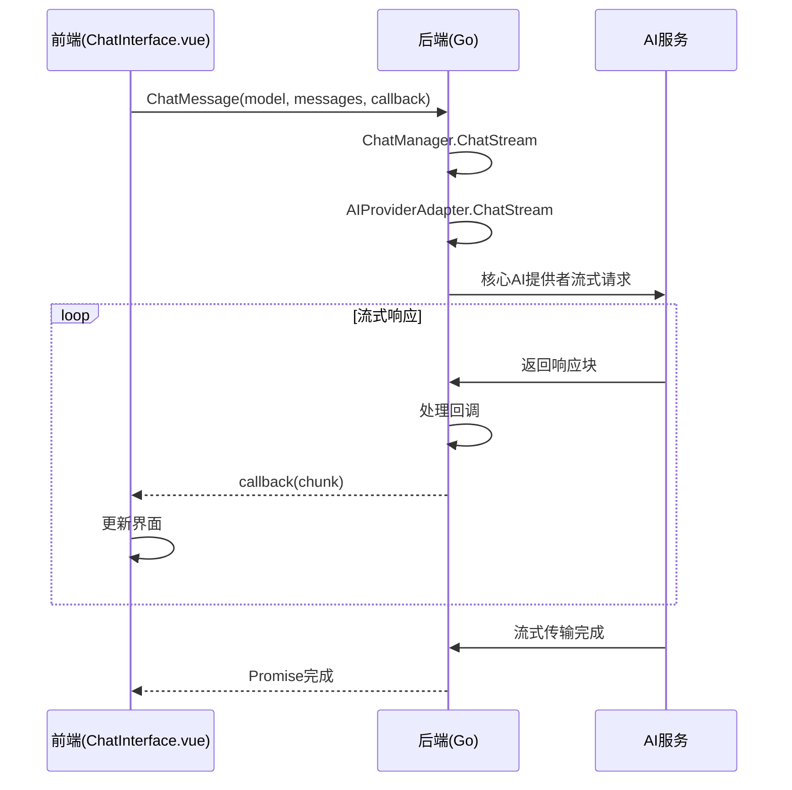
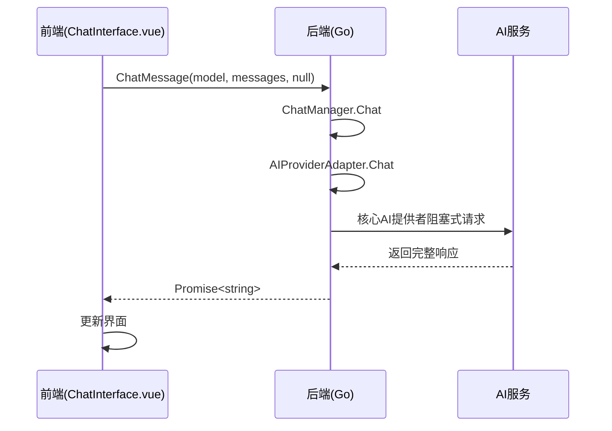
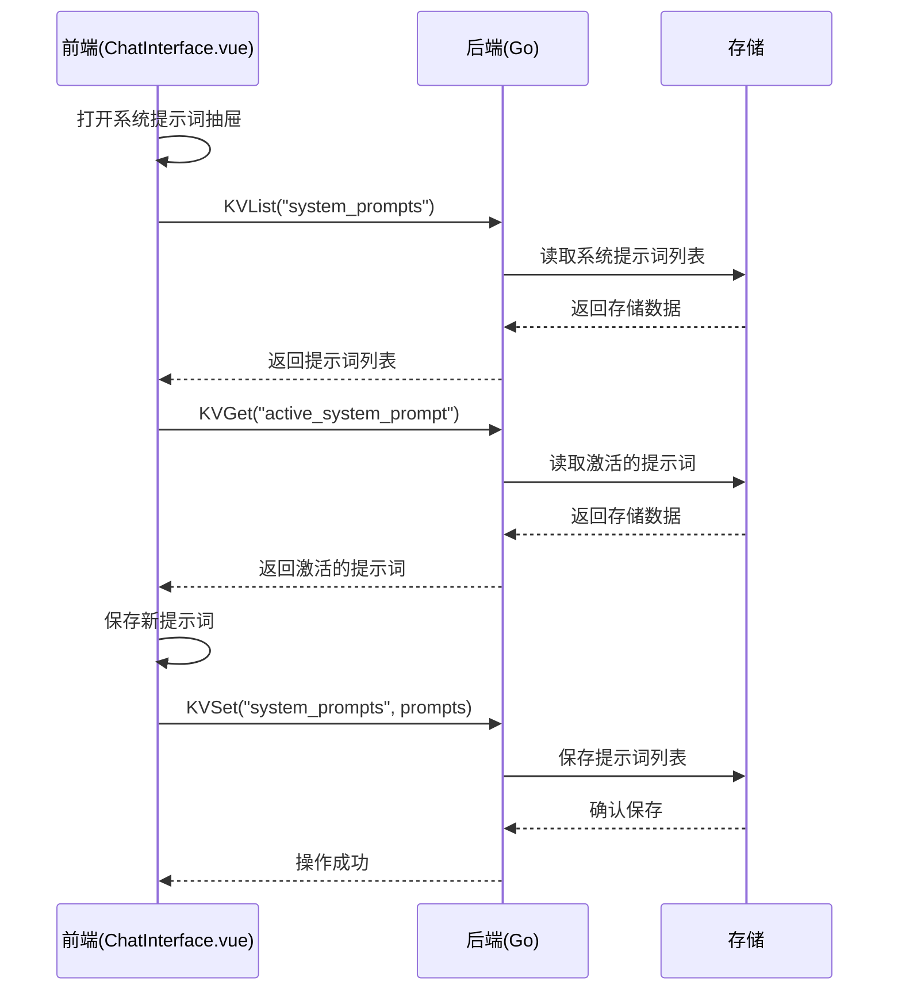

# ChatManager API 接口文档

## 接口概览

ChatManager 通过 Wails 框架提供的绑定机制与前端进行通信，实现聊天功能。所有接口均通过 `../../wailsjs/go/main/App` 导入。

## 接口列表

### 1. ChatMessage

发送聊天消息到AI模型。

**前端调用**：
```typescript
import { ChatMessage } from '../../wailsjs/go/main/App'

// 流式传输
ChatMessage(modelName: string, messages: Message[], callback: (chunk: string) => void): Promise<string>

// 阻塞传输
ChatMessage(modelName: string, messages: Message[], callback: null): Promise<string>
```

**参数说明**：

| 参数名 | 类型 | 必填 | 说明 |
|--------|------|------|------|
| modelName | string | 是 | 模型名称 |
| messages | Message[] | 是 | 消息列表 |
| callback | function/null | 是 | 流式回调函数或null |

**返回值说明**：

| 类型 | 说明 |
|------|------|
| Promise<string> | 阻塞式传输返回完整响应，流式传输返回空字符串 |

**后端实现**：
```go
// ChatMessage 发送聊天消息到Ollama API
func (a *App) ChatMessage(modelName string, messages []Message, callback func(string)) (string, error) {
    defer func() {
        if r := recover(); r != nil {
            log.Printf("ChatMessage方法中发生恐慌: %v", r)
        }
    }()
    
    log.Printf("ChatMessage调用: 模型=%s, 消息数量=%d, 是否流式=%t", modelName, len(messages), callback != nil)
    
    // 如果提供了回调函数，则使用流式传输
    if callback != nil {
        log.Printf("使用流式传输")
        // 使用聊天管理器发送流式消息
        err := a.chatManager.ChatStream(modelName, messages, func(content string) {
            log.Printf("App.ChatMessage流式回调，内容长度=%d", len(content))
            callback(content)
        })
        return "", err
    } else {
        log.Printf("使用阻塞式传输")
        // 使用阻塞式传输
        result, err := a.chatManager.Chat(modelName, messages)
        if err != nil {
            log.Printf("阻塞式传输错误: %v", err)
            return "", err
        }
        log.Printf("阻塞式传输成功，结果长度=%d", len(result))
        log.Printf("阻塞式传输返回结果前100个字符: %s", func() string {
            if len(result) > 100 {
                return result[:100] + "..."
            }
            return result
        }())
        return result, nil
    }
}
```

**错误处理**：
- 模型不存在时返回错误
- 网络连接失败时返回错误
- 参数验证失败时返回错误

### 2. KVSet

设置键值对存储。

**前端调用**：
```typescript
import { KVSet } from '../../wailsjs/go/main/App'

KVSet(key: string, value: string): Promise<void>
```

**参数说明**：

| 参数名 | 类型 | 必填 | 说明 |
|--------|------|------|------|
| key | string | 是 | 存储键名 |
| value | string | 是 | 存储值 |

**后端实现**：
```go
// KVSet 设置键值对
func (a *App) KVSet(key string, value string) error {
    return a.chatManager.KVSet(key, value)
}
```

### 3. KVGet

获取键值对存储。

**前端调用**：
```typescript
import { KVGet } from '../../wailsjs/go/main/App'

KVGet(key: string): Promise<string>
```

**参数说明**：

| 参数名 | 类型 | 必填 | 说明 |
|--------|------|------|------|
| key | string | 是 | 存储键名 |

**后端实现**：
```go
// KVGet 获取键值对
func (a *App) KVGet(key string) (string, error) {
    return a.chatManager.KVGet(key)
}
```

### 4. KVList

获取键值对列表。

**前端调用**：
```typescript
import { KVList } from '../../wailsjs/go/main/App'

KVList(key: string): Promise<string>
```

**参数说明**：

| 参数名 | 类型 | 必填 | 说明 |
|--------|------|------|------|
| key | string | 是 | 存储键名前缀 |

**后端实现**：
```go
// KVList 获取键值对列表
func (a *App) KVList(key string) (string, error) {
    return a.chatManager.KVList(key)
}
```

### 5. KVDelete

删除键值对。

**前端调用**：
```typescript
import { KVDelete } from '../../wailsjs/go/main/App'

KVDelete(key: string): Promise<void>
```

**参数说明**：

| 参数名 | 类型 | 必填 | 说明 |
|--------|------|------|------|
| key | string | 是 | 存储键名 |

**后端实现**：
```go
// KVDelete 删除键值对
func (a *App) KVDelete(key string) error {
    return a.chatManager.KVDelete(key)
}
```

## 核心后端方法

### 1. ChatManager.Chat

阻塞式聊天方法。

**方法签名**：
```go
func (cm *ChatManager) Chat(modelName string, messages []Message) (string, error)
```

**功能说明**：
发送聊天消息并等待完整响应。

**日志记录**：
- 开始阻塞式聊天
- 阻塞式聊天完成
- 错误处理日志

### 2. ChatManager.ChatStream

流式聊天方法。

**方法签名**：
```go
func (cm *ChatManager) ChatStream(modelName string, messages []Message, callback func(string)) error
```

**功能说明**：
发送聊天消息并逐步接收响应。

**日志记录**：
- 开始流式聊天
- 流式回调处理
- 错误处理日志

### 3. AIProviderAdapter.Chat

AI提供者适配器阻塞式聊天方法。

**方法签名**：
```go
func (a *AIProviderAdapter) Chat(model string, messages []Message) (string, error)
```

**功能说明**：
适配不同类型消息结构并调用核心提供者。

**日志记录**：
- 开始阻塞式聊天请求
- 阻塞式聊天请求成功
- 错误处理日志

### 4. AIProviderAdapter.ChatStream

AI提供者适配器流式聊天方法。

**方法签名**：
```go
func (a *AIProviderAdapter) ChatStream(model string, messages []Message, callback func(string)) error
```

**功能说明**：
适配不同类型消息结构并调用核心提供者进行流式传输。

**日志记录**：
- 开始流式聊天请求
- 流式回调处理
- 错误处理日志

## 接口调用时序

### 流式聊天时序


### 阻塞式聊天时序


### 系统提示词管理时序


## 错误处理规范

### 前端错误处理
1. 所有异步调用都应使用 try/catch 包装
2. 错误信息应通过 ElMessage 显示给用户
3. 网络错误应提供重试机制
4. 流式传输错误应保持已接收部分

### 后端错误处理
1. 所有接口都应返回 error 类型
2. 错误信息应包含具体原因
3. 对于用户可处理的错误，应提供明确的处理建议
4. 使用 recover 机制捕获恐慌

### 网络超时处理
1. 设置合理的超时时间（建议30秒）
2. 超时错误应提示用户检查网络连接
3. 提供重试按钮

## 数据一致性保证

### 读写一致性
1. 所有写操作完成后立即刷新读取
2. 使用乐观锁机制防止并发写冲突
3. 关键操作记录操作日志

### 状态同步
1. 页面间通过事件机制同步状态变化
2. 应用重启后从存储中恢复状态
3. 多设备间通过云同步保持一致