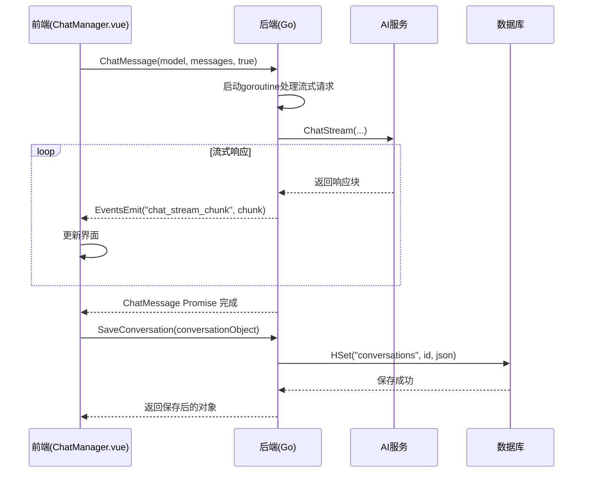

# ChatManager API 接口文档

## 接口概览

通过 Wails 框架提供的绑定机制与前端进行通信，实现聊天和对话管理功能。所有接口均通过 `../../wailsjs/go/main/App` 导入。

## 接口列表

### 对话管理接口

1.  **ListConversations**
    - **功能**: 获取所有已保存的对话列表，按时间倒序排列。
    - **前端调用**: `ListConversations(): Promise<Conversation[]>`
    - **后端实现**: `func (a *App) ListConversations() ([]*Conversation, error)`

2.  **SaveConversation**
    - **功能**: 创建或更新一个对话。如果传入的`Conversation`对象ID为空，则为新创建；否则为更新。
    - **前端调用**: `SaveConversation(conv: Conversation): Promise<Conversation>`
    - **后端实现**: `func (a *App) SaveConversation(conv *Conversation) (*Conversation, error)`

3.  **GetConversation**
    - **功能**: 获取指定ID的单个对话的完整内容。
    - **前端调用**: `GetConversation(id: string): Promise<Conversation>`
    - **后端实现**: `func (a *App) GetConversation(id string) (*Conversation, error)`

4.  **DeleteConversation**
    - **功能**: 删除指定ID的对话。
    - **前端调用**: `DeleteConversation(id: string): Promise<void>`
    - **后端实现**: `func (a *App) DeleteConversation(id string) error`

### 聊天接口

1.  **ChatMessage**
    - **功能**: 发送聊天消息到AI模型。
    - **前端调用**: `ChatMessage(modelName: string, messages: Message[], stream: boolean): Promise<string>`
    - **参数说明**:
        - `modelName`: 模型名称。
        - `messages`: 消息列表。
        - `stream`: 是否使用流式传输。`true`为流式，`false`为阻塞式。
    - **通信方式**:
        - **流式**: 后端通过Wails Events向前端发送 `chat_stream_chunk` 事件，前端需提前监听此事件来接收数据。
        - **阻塞式**: 直接通过 `Promise` 返回完整的AI回复字符串。
    - **后端实现**: `func (a *App) ChatMessage(modelName string, messages []Message, stream bool) (string, error)`

### 服务器与模型接口

1.  **ListModelsByServer**
    - **功能**: 获取指定服务器上的所有可用模型列表。
    - **前端调用**: `ListModelsByServer(serverID: string): Promise<string[]>`
    - **后端实现**: `func (a *App) ListModelsByServer(serverID string) ([]string, error)`

2.  **GetRemoteServers**
    - **功能**: 获取所有已配置的远程服务器列表。
    - **前端调用**: `GetRemoteServers(): Promise<OllamaServerConfig[]>`
    - **后端实现**: `func (a *App) GetRemoteServers() ([]OllamaServerConfig, error)`

## 核心流程时序图

### 流式聊天与自动保存时序

