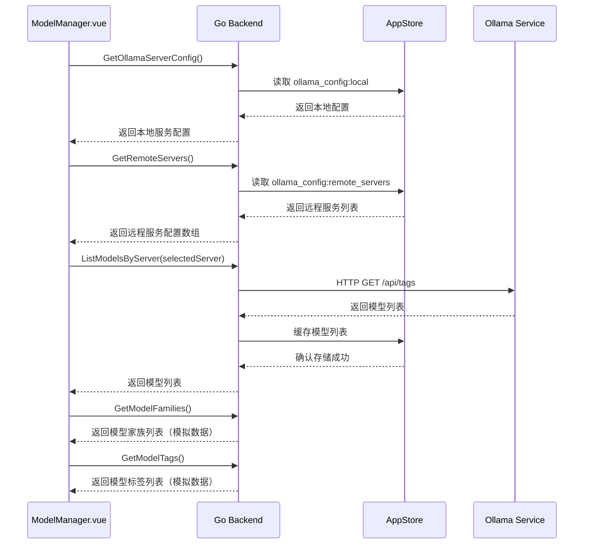
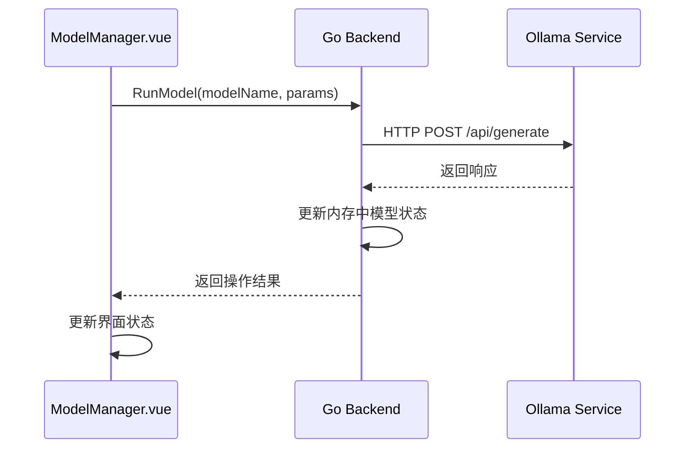
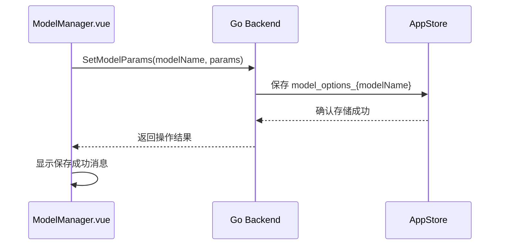
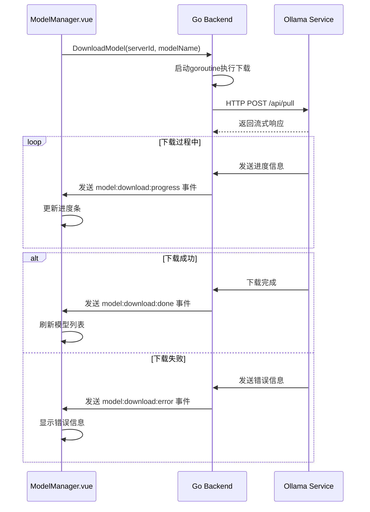
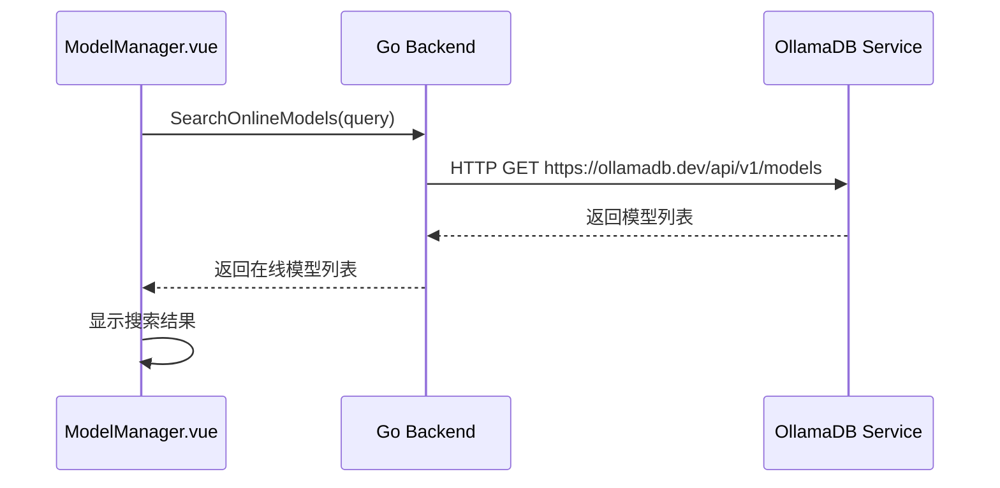

# ModelManager 页面数据结构

## 1. Architecture（架构设计）

### 1.1 数据架构概述
为了统一前端类型定义，提高代码可维护性和健壮性，ModelManager模块采用了统一的数据结构管理策略。数据类型主要来源于 Wails 自动生成的 `models.ts` 文件和统一的 `types.ts` 文件。

### 1.2 数据流架构
```
前端 Vue 组件
    │
    │ TypeScript 接口
    │
    v
Wails 自动生成层
    │
    │ JSON 序列化
    │
    v
Go 后端服务
    │
    │ HTTP/gRPC
    │
    v
Ollama API / 数据存储
```

## 2. Analysis（需求分析）

### 2.1 数据类型需求
| 数据类型 | 使用场景 | 复杂度 | 优先级 |
|----------|----------|----------|----------|
| Model | 模型信息展示 | 中 | P0 |
| OllamaServerConfig | 服务器配置 | 低 | P0 |
| ModelParams | 参数配置 | 低 | P1 |
| DownloadProgress | 下载进度 | 中 | P1 |
| OnlineModel | 在线模型 | 低 | P2 |

### 2.2 关键修复需求
**修改时间字段映射问题**:
- **问题**: 前端 `modifiedAt` vs 后端 `modified_at` 不匹配
- **影响**: 显示 "Invalid Date Invalid Date"
- **解决**: 统一使用 `modified_at` 字段名
- **状态**: ✅ 已修复

## 3. Architecture（数据架构）

### 3.1 前端数据结构

#### 数据结构统一化策略
采用 Wails 自动生成 + 统一类型定义的混合模式，确保前后端数据模型完全一致。

```typescript
// 数据源策略
│
├── Wails 自动生成 (../../wailsjs/go/models.ts)
│   ├── OllamaServerConfig
│   ├── Model (基础结构)
│   └── ModelParams
│
└── 统一类型定义 (../../classes/types.ts)
    ├── FrontendModel (扩展 Model)
    ├── DownloadProgress
    └── 其他前端特有类型
```

#### 3.1.1 模型结构 (Model) **[已修复]**
该结构体扩展了 `types.Model`，增加了前端特有的 `isRunning` 属性，用于表示模型在 UI 上的运行状态。它统一在 `../../classes/types.ts` 中定义和导出。
```typescript
// 示例导入方式 (在 .vue 文件中):
import { FrontendModel } from "../../classes/types";
```

```typescript
// 修复后的模型结构
interface Model {
  name: string;              // 模型名称
  model: string;             // 模型 ID
  modified_at: string;       // [已修复] 修改时间字段
  size: number;              // 模型大小（字节）
  digest: string;            // 模型摘要
  details: {
    family?: string;         // [新增] 模型家族
    format?: string;         // [新增] 模型格式
    parameter_size?: string; // [新增] 参数规模
    quantization_level?: string; // [新增] 量化级别
    parent_model?: string;   // [新增] 父模型
    families?: string[];     // [新增] 支持的模型类型
  };
  isRunning: boolean;        // 运行状态
}
```

#### 3.1.2 服务器配置结构 (OllamaServerConfig)
该结构体现在直接从 Wails 自动生成的 `../../wailsjs/go/models.ts` 中导入。
其定义与后端 Go 语言的 `main.OllamaServerConfig` 结构体保持一致。
```typescript
// 示例导入方式 (在 .vue 文件中):
import { types } from "../../wailsjs/go/models";
import OllamaServerConfig = types.OllamaServerConfig;
```

#### 3.1.3 模型参数结构 (ModelParams)
该结构体已从各组件中抽取，统一在 `../../classes/types.ts` 中定义和导出。
```typescript
// 示例导入方式 (在 .vue 文件中):
import { ModelParams } from "../../classes/types";
```

#### 3.1.4 下载进度结构 (DownloadProgress) **[已增强]**
该结构体已从组件中抽取，统一在 `../../classes/types.ts` 中定义和导出。
```typescript
// 示例导入方式 (在 .vue 文件中):
import { DownloadProgress } from "../../classes/types";

// 增强后的下载进度结构
interface DownloadProgress {
  id: string;              // 下载任务ID
  modelName: string;       // 模型名称
  serverID: string;        // 服务器ID
  status: 'pending' | 'downloading' | 'completed' | 'failed' | 'cancelled';
  progress: number;        // 进度百分比 (0-100)
  total: number;           // 总大小（字节）
  completed: number;       // 已完成大小（字节）
  speed?: number;          // 下载速度（字节/秒）
  remainingTime?: number;  // 预计剩余时间（秒）
  error?: string;          // 错误信息
  startTime: Date;         // 开始时间
  endTime?: Date;          // 结束时间
}
```

#### 3.1.5 模型测试结构 (ModelTestData) **[新增]**
该结构体用于模型测试功能的数据管理。
```typescript
// 示例导入方式 (在 .vue 文件中):
import { ModelTestData } from "../../classes/types";

// 模型测试数据结构
interface ModelTestData {
  prompt: string;          // 测试提示词
  response: string;        // 模型响应
  isLoading: boolean;      // 是否正在测试
  error?: string;          // 错误信息
  timestamp: Date;         // 测试时间
  duration?: number;       // 响应时长（毫秒）
}
```

### 3.2 后端数据结构

#### 3.2.1 Model 结构体 **[已修复]**

```go
// Model 模型信息 [已修复]
type Model struct {
    Name       string                 `json:"name"`
    Model      string                 `json:"model"`
    ModifiedAt string                 `json:"modified_at"` // [修复] 字段映射
    Size       int64                  `json:"size"`
    Digest     string                 `json:"digest"`
    Details    map[string]interface{} `json:"details"` // [增强] 完整详情
    IsRunning  bool                   `json:"isRunning"` // [新增] 运行状态
}
```

#### 3.2.2 OllamaServerConfig 结构体

```go
// OllamaServerConfig Ollama服务器配置
type OllamaServerConfig struct {
    ID         string `json:"id"`
    Name       string `json:"name"`
    BaseURL    string `json:"baseUrl"`
    APIKey     string `json:"apiKey"`
    IsActive   bool   `json:"isActive"` 
    TestStatus string `json:"testStatus"`
}
```

#### 3.2.3 ModelParams 结构体

```go
// ModelParams 模型参数
type ModelParams struct {
    Temperature   float64 `json:"temperature"`
    TopP          float64 `json:"topP"`
    TopK          int     `json:"topK"`
    Context       int     `json:"context"`
    NumPredict    int     `json:"numPredict"`
    RepeatPenalty float64 `json:"repeatPenalty"`
}
```

#### 3.2.4 OnlineModel 结构体

```go
// OnlineModel 在线模型信息
type OnlineModel struct {
    Name        string `json:"name"`
    PullCount   int64  `json:"pullCount"`
    UpdatedAt   string `json:"updatedAt"`
    Description string `json:"description"`
}
```

#### 3.2.5 TestModelRequest 结构体 **[新增]**

```go
// TestModelRequest 模型测试请求
type TestModelRequest struct {
    ModelName string `json:"modelName"`
    Prompt    string `json:"prompt"`
    Stream    bool   `json:"stream"`
}
```

#### 3.2.6 TestModelResponse 结构体 **[新增]**

```go
// TestModelResponse 模型测试响应
type TestModelResponse struct {
    Response string `json:"response"`
    Done     bool   `json:"done"`
    Error    string `json:"error,omitempty"`
}
```

#### 3.2.7 DownloadTask 结构体 **[新增]**

```go
// DownloadTask 下载任务信息
type DownloadTask struct {
    ID         string    `json:"id"`
    ModelName  string    `json:"modelName"`
    ServerID   string    `json:"serverID"`
    Status     string    `json:"status"` // pending, downloading, completed, failed, cancelled
    Progress   float64   `json:"progress"`
    Total      int64     `json:"total"`
    Completed  int64     `json:"completed"`
    StartTime  time.Time `json:"startTime"`
    EndTime    *time.Time `json:"endTime,omitempty"`
    Error      string    `json:"error,omitempty"`
}
```

## 4. Application（应用实现）

### 4.1 前端状态管理

#### 响应式数据定义

```typescript
// 模型列表
const localModels = ref<FrontendModel[]>([])

// 选中的模型
const selectedModel = ref<FrontendModel | null>(null)

// 加载状态
const loading = ref(false)

// 可用服务器列表
const availableServers = ref<OllamaServerConfig[]>([])

// 选中的服务器
const selectedServer = ref<string>('local')

// 详情抽屉可见性
const drawerVisible = ref(false)

// 下载对话框可见性
const downloadDialogVisible = ref(false)

// 要下载的模型名称
const modelNameToDownload = ref('')

// 是否正在下载
const isDownloading = ref(false)

// 下载进度记录
const downloadProgresses = reactive<Record<string, DownloadProgress>>({})

// 下载队列抽屉可见性
const downloadQueueDrawerVisible = ref(false)

// 是否正在运行模型
const isRunningModel = ref(false)

// 是否正在停止模型
const isStoppingModel = ref(false)

// 是否正在测试模型
const isTestingModel = ref(false)

// 测试提示词
const testPrompt = ref('你好，请用中文简单介绍一下自己。')

// 测试结果
const testResult = ref('')

// 模型参数
const modelParams = reactive<ModelParams>({
  temperature: 0.8,
  topP: 0.9,
  topK: 40,
  context: 2048,
  numPredict: 512,
  repeatPenalty: 1.1
})
```

#### 计算属性定义

```typescript
// 下载队列
const downloadQueue = computed(() => Object.values(downloadProgresses))

// 模型测试相关状态 **[新增]**
const modelTestData = reactive<ModelTestData>({
  prompt: '你好，请用中文简单介绍一下自己。',
  response: '',
  isLoading: false,
  timestamp: new Date()
})

// 下载任务管理 **[新增]**
const downloadTasks = ref<DownloadTask[]>([])
const activeDownloads = computed(() => 
  downloadTasks.value.filter(task => task.status === 'downloading')
)
const completedDownloads = computed(() => 
  downloadTasks.value.filter(task => task.status === 'completed')
)
const failedDownloads = computed(() => 
  downloadTasks.value.filter(task => task.status === 'failed')
)
```

### 4.2 数据流设计

#### 页面初始化数据流



#### 模型运行数据流



#### 模型参数保存数据流



#### 模型下载数据流



#### 在线模型搜索数据流



## 5. Assurance（质量保证）

### 5.1 数据验证规则

#### 前端验证规则

1. **模型参数**
   - temperature: 0.0-1.0
   - topP: 0.0-1.0
   - context: 1-32768
   - topK: 正整数
   - numPredict: 正整数
   - repeatPenalty: 正数

2. **模型名称**
   - 非空验证
   - 长度限制：1-100个字符

3. **服务器配置**
   - URL格式验证
   - 必填字段验证

#### 后端验证规则

1. **模型操作**
   - 模型存在性验证
   - 模型状态验证（运行/停止状态）
   - 参数范围验证

2. **服务器操作**
   - 服务器可达性验证
   - 服务器配置有效性验证

3. **参数验证**
   - 类型验证
   - 范围验证
   - 必填字段验证

4. **在线模型搜索**
   - 搜索关键词长度验证
   - 搜索结果数量限制

### 5.2 数据同步机制

#### 页面间数据同步
- 通过服务器配置与 OllamaSettings 页面保持同步
- 模型状态在页面刷新时重置
- 通过 API 调用保持与 Ollama 服务状态同步

#### 应用重启数据恢复
- 服务器配置持久化存储在本地数据库中
- 模型参数配置持久化存储
- 模型列表缓存（临时存储，应用重启后需要重新获取）

### 5.3 错误处理保证

#### 数据相关错误

1. **存储读取失败**
   - 返回默认值而非报错
   - 记录错误日志
   - 提示用户可能的配置丢失

2. **存储写入失败**
   - 显示错误消息
   - 保持界面状态
   - 提供重试机制

3. **数据格式错误**
   - 尝试修复或重置数据
   - 记录错误日志
   - 必要时提示用户

#### 网络相关错误

1. **模型列表获取失败**
   - 显示错误消息
   - 保持现有列表或显示空状态
   - 提供刷新重试按钮

2. **模型操作失败**
   - 显示具体错误信息
   - 保持界面状态一致性
   - 提供重试机制

3. **服务器连接失败**
   - 显示连接错误信息
   - 建议检查服务器配置
   - 提供跳转到配置页面的链接（待实现）

4. **在线模型搜索失败**
   - 显示搜索失败消息
   - 保持现有在线模型列表
   - 提供重试搜索按钮

## 6. Action（行动计划）

### 6.1 已完成优化
- ✅ 修改时间字段映射修复
- ✅ 模型详情结构增强
- ✅ 数据类型统一化
- ✅ 错误处理完善

### 6.2 近期计划
- 🔄 数据缓存优化（模型列表、参数配置缓存）
- 🔄 数据验证增强（前后端双重验证）
- 🔄 实时数据同步（WebSocket支持）
- 🔄 下载队列持久化（应用重启后恢复下载任务）

### 6.3 长期规划
- 📅 数据分页加载（大量模型时的性能优化）
- 📅 数据压缩传输（减少网络带宽占用）
- 📅 离线数据支持（离线模式下的基本功能）
- 📅 数据同步机制（多设备间的配置同步）
