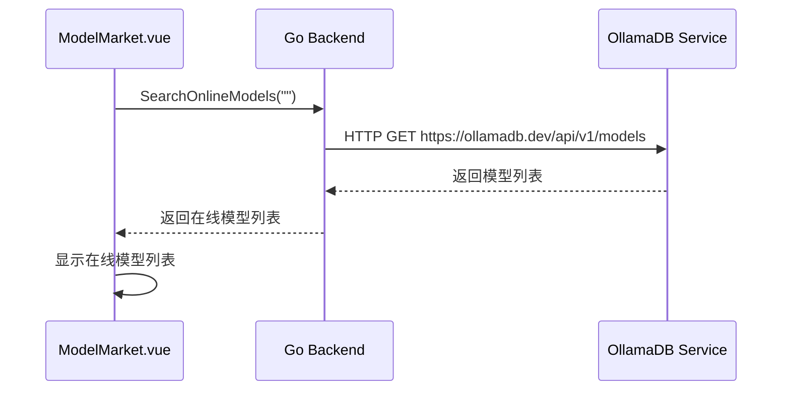
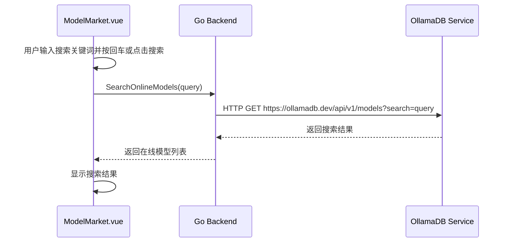

# ModelMarket 页面数据结构

## 1. 前端数据结构

### 概述
为了统一前端类型定义，提高代码可维护性和健壮性，ModelMarket模块中使用的数据结构已进行重构。现在，这些类型主要来源于统一抽取的 `../../classes/types.ts` 文件。

### 1.1 在线模型结构 (OnlineModel)
该结构体已从组件中抽取，统一在 `../../classes/types.ts` 中定义和导出。

```typescript
// 示例导入方式 (在 .vue 文件中):
import { OnlineModel } from "../../classes/types";
```

## 2. 后端数据结构

### 2.1 在线模型结构 (OnlineModel)
后端返回的 `OnlineModel` 结构体，其字段与前端 `OnlineModel` 接口一一对应。

```go
// OnlineModel 在线模型信息
type OnlineModel struct {
    ModelIdentifier string   `json:"model_identifier"`
    Namespace       *string  `json:"namespace"`
    ModelName       string   `json:"model_name"`
    ModelType       string   `json:"model_type"`
    Description     string   `json:"description"`
    Capability      *string  `json:"capability"`
    Labels          []string `json:"labels"`
    Pulls           int      `json:"pulls"`
    Tags            int      `json:"tags"`
    LastUpdated     string   `json:"last_updated"`
    LastUpdatedStr  string   `json:"last_updated_str"`
    URL             string   `json:"url"`
}
```

## 3. 状态管理

### 响应式数据

```typescript
// 搜索关键词
const searchText = ref('')

// 在线模型列表
const onlineModels = ref<OnlineModel[]>([])

// 在线模型加载状态
const loading = ref(false)

// 模型详情抽屉可见性
const drawerVisible = ref(false)

// 选中的模型
const selectedModel = ref<OnlineModel | null>(null)
```

## 4. 数据流设计

### 页面初始化数据流



### 模型搜索数据流


