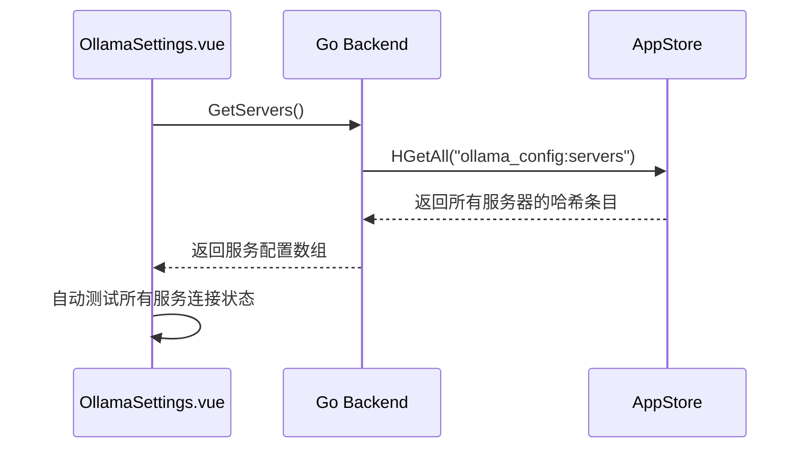
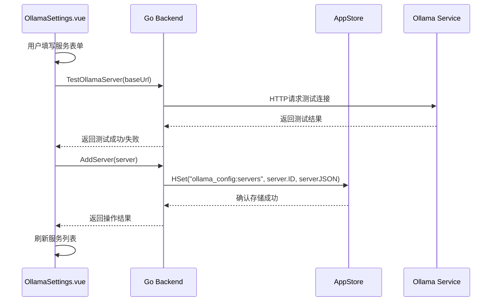
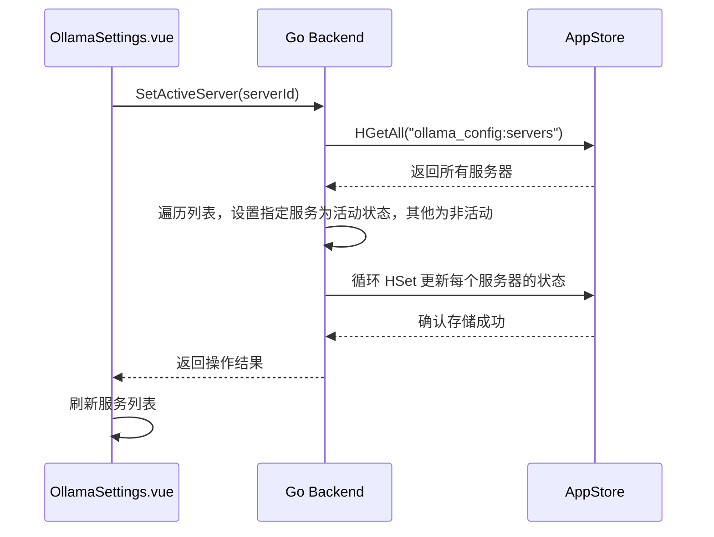

# OllamaSettings 页面数据结构

## 1. 前端数据结构

### 概述
为了统一前端类型定义，提高代码可维护性和健壮性，OllamaSettings模块中使用的数据结构已进行重构。现在，前端主要使用 Wails 自动生成的 `../../wailsjs/go/models.ts` 中的 `OllamaServerConfig` 类型，并对需要前端扩展的属性，定义在统一抽取的 `../../classes/types.ts` 中的 `FrontendOllamaServerConfig` 类型。这消除了前端重复的接口定义，确保了前后端数据模型的一致性。

### 1.1 服务器配置结构 (OllamaServerConfig)
该结构体现在直接从 Wails 自动生成的 `../../wailsjs/go/models.ts` 中导入。
其定义与后端 Go 语言的 `main.OllamaServerConfig` 结构体保持一致。
```typescript
// 示例导入方式 (在 .vue 文件中):
import { types } from "../../wailsjs/go/models";
import OllamaServerConfig = types.OllamaServerConfig;
```

### 1.2 前端扩展服务器配置结构 (FrontendOllamaServerConfig)
该结构体扩展了 `OllamaServerConfig`，增加了前端特有的 `isTesting?: boolean` 属性，用于表示服务连接测试状态。它统一在 `../../classes/types.ts` 中定义和导出。
```typescript
// 示例导入方式 (在 .vue 文件中):
import { FrontendOllamaServerConfig } from "../../classes/types";
```

## 2. 后端数据结构

### 2.1 OllamaServerConfig 结构体

```go
type OllamaServerConfig struct {
    ID         string `json:"id"`         // 服务ID
    Name       string `json:"name"`       // 服务名称
    BaseURL    string `json:"baseUrl"`   // 基础URL
    APIKey     string `json:"apiKey"`    // API密钥
    IsActive   bool   `json:"isActive"`  // 是否为活动服务器
    TestStatus string `json:"testStatus"`// 测试状态
}
```

### 字段详细说明

| 字段名 | 类型 | JSON标签 | 说明 |
|--------|------|----------|------|
| ID | string | id | 服务唯一标识符 |
| Name | string | name | 服务名称 |
| BaseURL | string | baseUrl | 服务基础URL |
| APIKey | string | apiKey | API密钥 |
| IsActive | bool | isActive | 是否为活动服务器 |
| TestStatus | string | testStatus | 测试状态 |

## 3. 状态枚举值

### testStatus 状态值

| 值 | 说明 |
|----|------|
| unknown | 未测试状态 |
| success | 连接测试成功 |
| failed | 连接测试失败 |

## 4. 数据存储设计

### [已重构] 服务列表存储

- **[已重构]** **存储方式**: 使用 `duolasdk` 的哈希（Hash）存储功能。
- **[已重构]** **主键 (Key)**: `"ollama_config:servers"`
- **[已重构]** **字段 (Field)**:
  - **字段名**: 每个服务器配置的 `ID`。
  - **字段值**: 单个 `OllamaServerConfig` 对象经过 JSON 序列化后的字符串。
- **[已重构]** **优点**: 这种方式取代了之前将整个列表存为一个JSON字符串的做法，使得增、删、改单个服务器配置时，无需读写整个列表，提高了效率和并发安全性。

### 活动服务器
- 通过服务器配置中的`isActive`字段标识。

## 5. 数据流设计

### 页面初始化数据流



### 添加服务数据流



### 设置默认服务数据流



## 6. 数据验证规则

### 前端验证规则

1. **服务名称**
   - 必填项
   - 长度限制：1-50个字符

2. **服务地址**
   - 必填项
   - 格式验证：必须是有效的URL格式
   - 协议限制：必须以http://或https://开头

3. **API密钥**
   - 选填项
   - 格式验证：如填写需符合API密钥格式要求

### 后端验证规则

1. **服务ID**
   - 必须唯一，不可重复

2. **服务名称**
   - 必填项
   - 长度限制：1-50个字符
   - 字符限制：不允许特殊字符（如<, >, &, 等）

3. **服务地址**
   - 必填项
   - 格式验证：必须是有效的URL格式
   - 协议验证：必须以http://或https://开头
   - 可达性验证：必须能够连接到该地址

4. **API密钥**
   - 选填项
   - 如填写需符合API密钥格式要求

## 7. 数据同步机制

### 页面间数据同步
- 页面加载时从存储中获取最新数据
- 操作完成后立即更新存储
- 多个页面实例间通过事件机制同步数据

### 应用重启数据恢复
- 所有配置持久化存储在本地数据库中
- 应用重启后自动加载配置
- 保持用户配置不丢失

## 8. 错误处理

### 数据相关错误

1. **存储读取失败**
   - 返回默认值而非报错
   - 记录错误日志
   - 提示用户可能的配置丢失

2. **存储写入失败**
   - 显示错误消息
   - 保持界面状态
   - 提供重试机制

3. **数据格式错误**
   - 尝试修复或重置数据
   - 记录错误日志
   - 必要时提示用户

### 网络相关错误

1. **连接测试失败**
   - 明确显示失败原因
   - 提供重试按钮
   - 更新服务状态标识

## 9. 前端状态管理

### 响应式数据

```typescript
// 所有服务器列表，包含前端扩展属性
const allServers = ref<FrontendOllamaServerConfig[]>([])

// 服务抽屉可见性
const serviceDrawerVisible = ref(false)

// 是否正在保存
const isSaving = ref(false)

// 服务表单引用
const serviceFormRef = ref<FormInstance>()

// 服务表单数据
const serviceForm = reactive<Partial<OllamaServerConfig>>({
  id: '',
  name: '',
  baseUrl: '',
  apiKey: '',
  testStatus: 'unknown'
});
```