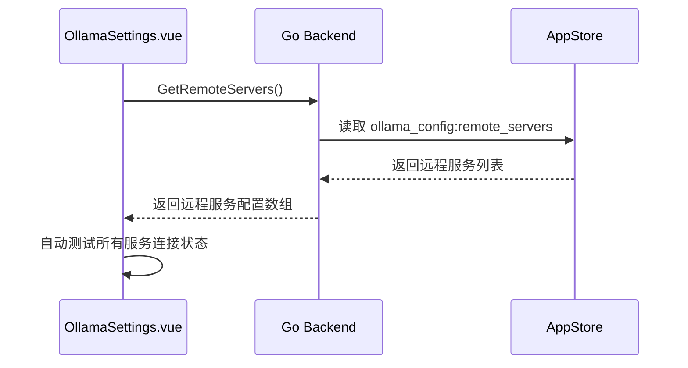
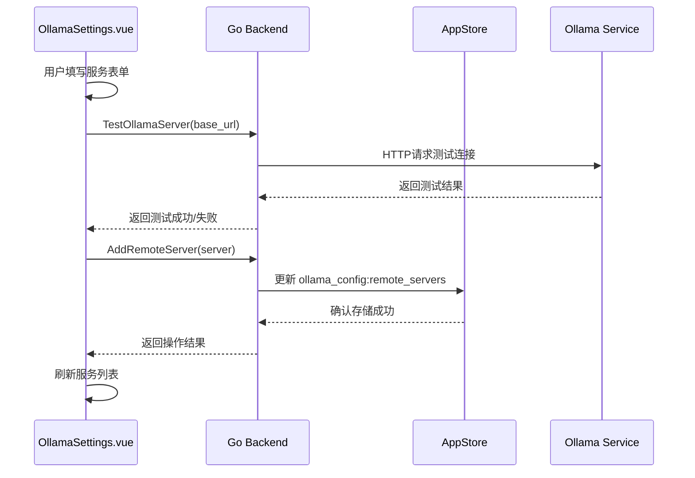
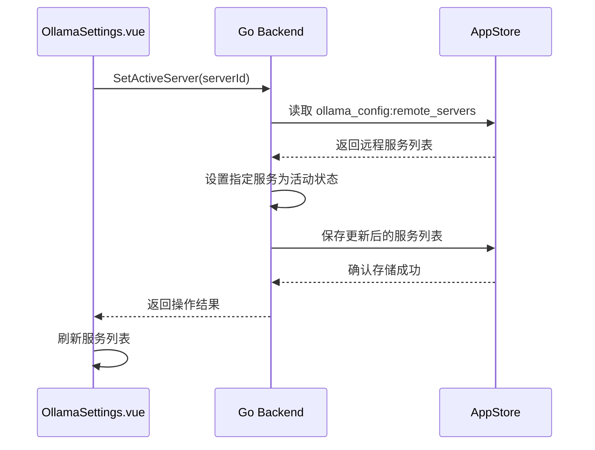

# OllamaSettings 页面数据结构

## 前端数据结构

### ServerConfig 接口

```typescript
interface ServerConfig {
  id: string;           // 服务唯一标识符
  name: string;         // 服务名称
  base_url: string;     // 服务基础URL
  api_key: string;      // API密钥（远程服务）
  is_active: boolean;   // 是否为活动/默认服务
  test_status: 'unknown' | 'success' | 'failed'; // 连接测试状态
  type: 'local' | 'remote'; // 服务类型
  is_running: boolean;  // 是否正在运行（本地服务）
  autoStart: boolean;   // 是否自动启动（本地服务）
}
```

### 字段详细说明

| 字段名 | 类型 | 必填 | 说明 |
|--------|------|------|------|
| id | string | 是 | 服务唯一标识符，本地服务固定为'local'，远程服务使用时间戳或UUID |
| name | string | 是 | 用户自定义的服务名称 |
| base_url | string | 是 | Ollama服务的基础URL地址 |
| api_key | string | 否 | 远程服务的API密钥，本地服务为空 |
| is_active | boolean | 是 | 标识是否为默认服务 |
| test_status | 'unknown' \| 'success' \| 'failed' | 是 | 连接测试状态 |
| type | 'local' \| 'remote' | 是 | 服务类型标识 |
| is_running | boolean | 是 | 本地服务运行状态 |
| autoStart | boolean | 是 | 本地服务自动启动设置 |

## 后端数据结构

### OllamaServerConfig 结构体

```go
type OllamaServerConfig struct {
    ID         string `json:"id"`         // 服务ID
    Name       string `json:"name"`       // 服务名称
    BaseURL    string `json:"base_url"`   // 基础URL
    APIKey     string `json:"api_key"`    // API密钥
    IsActive   bool   `json:"is_active"`  // 是否为活动服务器
    TestStatus string `json:"test_status"`// 测试状态
}
```

### 字段详细说明

| 字段名 | 类型 | JSON标签 | 说明 |
|--------|------|----------|------|
| ID | string | id | 服务唯一标识符 |
| Name | string | name | 服务名称 |
| BaseURL | string | base_url | 服务基础URL |
| APIKey | string | api_key | API密钥 |
| IsActive | bool | is_active | 是否为活动服务器 |
| TestStatus | string | test_status | 测试状态 |

## 状态枚举值

### test_status 状态值

| 值 | 说明 |
|----|------|
| unknown | 未测试状态 |
| success | 连接测试成功 |
| failed | 连接测试失败 |

### type 类型值

| 值 | 说明 |
|----|------|
| local | 本地服务 |
| remote | 远程服务 |

## 数据存储设计

### 本地存储键名

1. **本地服务配置**
   - 键名：`ollama_config:local`
   - 内容：本地服务的基础URL字符串

2. **远程服务列表**
   - 键名：`ollama_config:remote_servers`
   - 内容：远程服务配置数组的JSON字符串

3. **活动服务器**
   - 通过远程服务配置中的`is_active`字段标识

### 存储示例

#### 本地服务配置存储
```
Key: ollama_config:local
Value: "http://localhost:11434"
```

#### 远程服务列表存储
```json
Key: ollama_config:remote_servers
Value: [
  {
    "id": "1234567890",
    "name": "开发环境",
    "base_url": "http://dev.example.com:11434",
    "api_key": "sk-xxx",
    "is_active": true,
    "test_status": "success"
  },
  {
    "id": "1234567891",
    "name": "测试环境",
    "base_url": "http://test.example.com:11434",
    "api_key": "sk-yyy",
    "is_active": false,
    "test_status": "unknown"
  }
]
```

## 数据流设计

### 页面初始化数据流



### 添加服务数据流



### 设置默认服务数据流



## 数据验证规则

### 前端验证规则

1. **服务名称**
   - 必填项
   - 长度限制：1-50个字符

2. **服务地址**
   - 必填项
   - 格式验证：必须是有效的URL格式
   - 协议限制：必须以http://或https://开头

3. **API密钥**
   - 选填项
   - 格式验证：如填写需符合API密钥格式要求

### 后端验证规则

1. **服务ID**
   - 本地服务：固定为"local"
   - 远程服务：必须唯一，不可重复

2. **服务名称**
   - 必填项
   - 长度限制：1-50个字符
   - 字符限制：不允许特殊字符（如<, >, &, 等）

3. **服务地址**
   - 必填项
   - 格式验证：必须是有效的URL格式
   - 协议验证：必须以http://或https://开头
   - 可达性验证：必须能够连接到该地址

4. **API密钥**
   - 选填项
   - 如填写需符合API密钥格式要求

## 数据同步机制

### 页面间数据同步
- 页面加载时从存储中获取最新数据
- 操作完成后立即更新存储
- 多个页面实例间通过事件机制同步数据

### 应用重启数据恢复
- 所有配置持久化存储在本地数据库中
- 应用重启后自动加载配置
- 保持用户配置不丢失

## 错误处理

### 数据相关错误

1. **存储读取失败**
   - 返回默认值而非报错
   - 记录错误日志
   - 提示用户可能的配置丢失

2. **存储写入失败**
   - 显示错误消息
   - 保持界面状态
   - 提供重试机制

3. **数据格式错误**
   - 尝试修复或重置数据
   - 记录错误日志
   - 必要时提示用户

### 网络相关错误

1. **连接测试失败**
   - 明确显示失败原因
   - 提供重试按钮
   - 更新服务状态标识