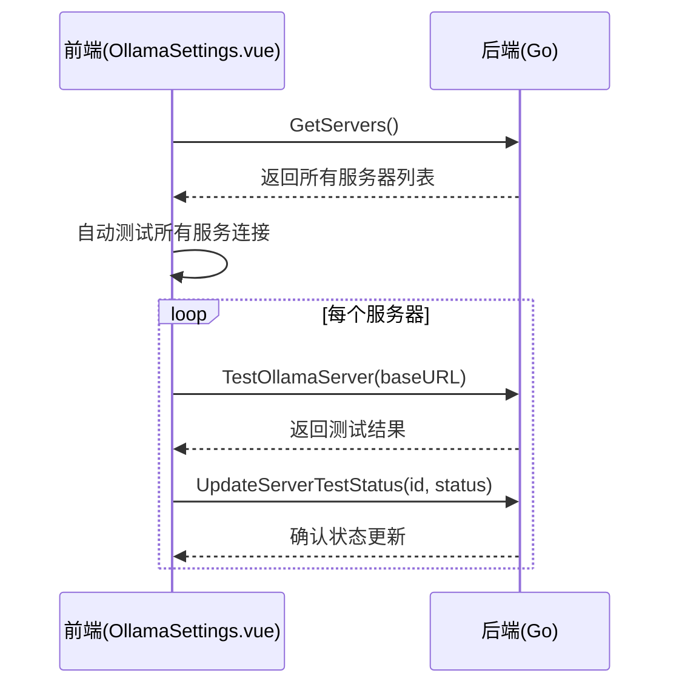
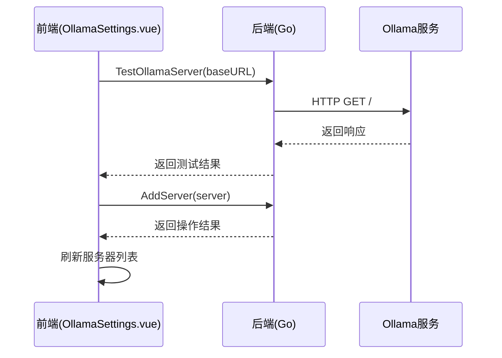
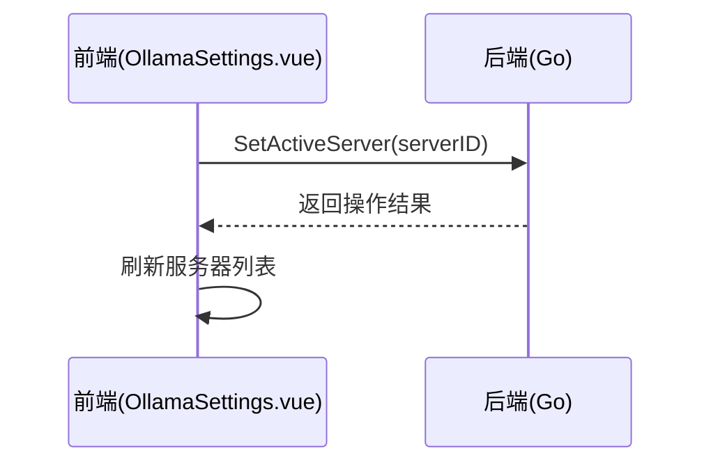

# OllamaSettings 页面 API 接口文档

## 接口概览

OllamaSettings 页面通过 Wails 框架提供的绑定机制与 Go 后端进行通信，实现服务配置的管理功能。

## 接口列表

### 1. GetServers
获取所有服务配置列表。

**前端调用**: `GetServers(): Promise<OllamaServerConfig[]>`
**后端实现**:
```go
func (a *App) GetServers() ([]OllamaServerConfig, error) {
    return a.configMgr.GetServers()
}
```

### 2. AddServer
添加一个新的服务配置。

**前端调用**: `AddServer(server: OllamaServerConfig): Promise<void>`
**后端实现**:
```go
func (a *App) AddServer(server OllamaServerConfig) error {
    return a.configMgr.AddServer(server)
}
```

### 3. UpdateServer
更新一个已存在的服务配置。

**前端调用**: `UpdateServer(server: OllamaServerConfig): Promise<void>`
**后端实现**:
```go
func (a *App) UpdateServer(server OllamaServerConfig) error {
    return a.configMgr.UpdateServer(server)
}
```

### 4. DeleteServer
删除一个服务配置。

**前端调用**: `DeleteServer(serverID: string): Promise<void>`
**后端实现**:
```go
func (a *App) DeleteServer(serverID string) error {
    return a.configMgr.DeleteServer(serverID)
}
```

### 5. SetActiveServer
设置活动服务器。

**前端调用**: `SetActiveServer(serverID: string): Promise<void>`
**后端实现**:
```go
func (a *App) SetActiveServer(serverID string) error {
    return a.configMgr.SetActiveServer(serverID)
}
```

### 6. TestOllamaServer
测试 Ollama 服务器连接。

**前端调用**: `TestOllamaServer(baseURL: string): Promise<string>`
**后端实现**:
```go
func (a *App) TestOllamaServer(baseURL string) (string, error) {
    // ... 内部实现通过HTTP访问服务器 ...
}
```

### 7. UpdateServerTestStatus
更新指定服务器的测试状态。

**前端调用**: `UpdateServerTestStatus(serverID: string, status: string): Promise<void>`
**后端实现**:
```go
func (a *App) UpdateServerTestStatus(serverID string, status string) error {
    return a.configMgr.UpdateServerTestStatus(serverID, status)
}
```

## [已废弃] 旧接口
- `SaveOllamaServerConfig`: 已被 `UpdateServer` 替代，用于更精细化的配置更新。
- `GetOllamaServerConfig`: 已被 `GetServers` 替代，现在统一获取所有服务器列表。
- `SaveRemoteServers`: 已被 `AddServer`, `UpdateServer`, `DeleteServer` 等原子操作替代。
- `GetRemoteServers`: 已被 `GetServers` 替代。

## 接口调用时序

### 页面加载时序


### 添加服务器时序


### 设置默认服务器时序


## 错误处理规范

### 前端错误处理
1. 所有异步调用都应使用 try/catch 包装。
2. 错误信息应通过 ElMessage 显示给用户。
3. 网络错误应提供重试机制。

### 后端错误处理
1. 所有接口都应返回 error 类型。
2. 错误信息应包含具体原因。
3. 对于用户可处理的错误，应提供明确的处理建议。

### 网络超时处理
1. 设置合理的超时时间（建议10秒）。
2. 超时错误应提示用户检查网络连接。
3. 提供重试按钮。

## 数据一致性保证

### 读写一致性
1. 所有写操作完成后立即刷新读取。
2. 使用哈希存储替代文件锁，提高并发安全性。
3. 关键操作记录操作日志。

### 状态同步
1. 页面间通过事件机制同步状态变化。
2. 应用重启后从存储中恢复状态。
3. 多设备间通过云同步保持一致。
